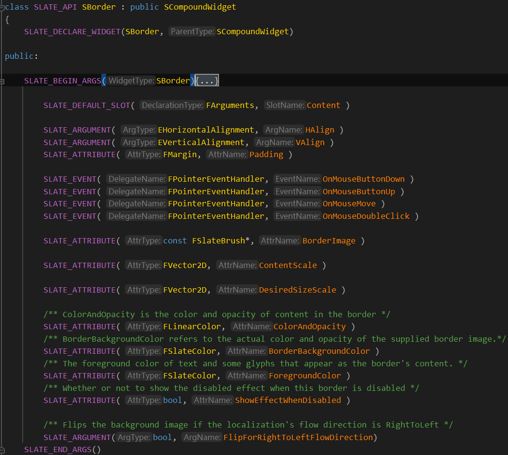

# SBorder

背景板控件，UMG里面用的很多，相当于一个背景板，可以控制内部控件的颜色，可以挂一个控件。




这是一个背景板控件，从SCompoundWidget继承过来，拥有一个插槽，FArguments参数类拥有水平对齐，垂直对齐，鼠标按下等委托，控制儿子控件的颜色，背景色，前景色等属性。


## ComputeDesiredSize

```c++
FVector2D SBorder::ComputeDesiredSize(float LayoutScaleMultiplier) const
{
    //我们可以指定一个固定大小的缩放，乘以父控件SCompoundWidget提供的固定大小
	return DesiredSizeScaleAttribute.Get() * Super::ComputeDesiredSize(LayoutScaleMultiplier);
}
```


## OnPaint

```c++
int32 SBorder::OnPaint( const FPaintArgs& Args, const FGeometry& AllottedGeometry, const FSlateRect& MyCullingRect, FSlateWindowElementList& OutDrawElements, int32 LayerId, const FWidgetStyle& InWidgetStyle, bool bParentEnabled ) const
{
    //获得背景画刷
	const FSlateBrush* BrushResource = BorderImageAttribute.Get();
		
	const bool bEnabled = ShouldBeEnabled(bParentEnabled);

	if ( BrushResource && BrushResource->DrawAs != ESlateBrushDrawType::NoDrawType )
	{
		const bool bShowDisabledEffect = GetShowDisabledEffect();
		const ESlateDrawEffect DrawEffects = (bShowDisabledEffect && !bEnabled) ? ESlateDrawEffect::DisabledEffect : ESlateDrawEffect::None;

        //画一下背景
        //如果指定了流向从右往左，则翻转一下
		if (bFlipForRightToLeftFlowDirection && GSlateFlowDirection == EFlowDirection::RightToLeft)
		{
             //重新计算一下FGeometry，然后构造一个图元放进OutDrawElements
			const FGeometry FlippedGeometry = AllottedGeometry.MakeChild(FSlateRenderTransform(FScale2D(-1, 1)));
			FSlateDrawElement::MakeBox(
				OutDrawElements,
				LayerId,
				FlippedGeometry.ToPaintGeometry(),
				BrushResource,
				DrawEffects,
                 //图片颜色 * 来自递归参数里面的颜色(来自父级) * 背景色
				BrushResource->GetTint(InWidgetStyle) * InWidgetStyle.GetColorAndOpacityTint() * BorderBackgroundColorAttribute.Get().GetColor(InWidgetStyle)
			);
		}
		else
		{
			FSlateDrawElement::MakeBox(
				OutDrawElements,
				LayerId,
				AllottedGeometry.ToPaintGeometry(),
				BrushResource,
				DrawEffects,
				BrushResource->GetTint(InWidgetStyle) * InWidgetStyle.GetColorAndOpacityTint() * BorderBackgroundColorAttribute.Get().GetColor(InWidgetStyle)
			);
		}
	}

    //画子槽的节点
	return SCompoundWidget::OnPaint(Args, AllottedGeometry, MyCullingRect, OutDrawElements, LayerId, InWidgetStyle, bEnabled );
}
```


## OnArrange

OnArrange函数，调用的是SCompoundWidget的函数。


## Construct

```c++
void SBorder::Construct(const SBorder::FArguments& InArgs)
{
	ChildSlot
	.HAlign(InArgs._HAlign)
	.VAlign(InArgs._VAlign)
	.Padding(InArgs._Padding)
	[
		InArgs._Content.Widget //让子槽挂一个控件
	];
}
```


Construct在Slate控件的创建过程和声明式语法里面有讲，参数类在Construct里面进一步组装。


可以看出，SBorder除了充当背景板，能够控制子控件的颜色，还可以控制子控件的大小。


