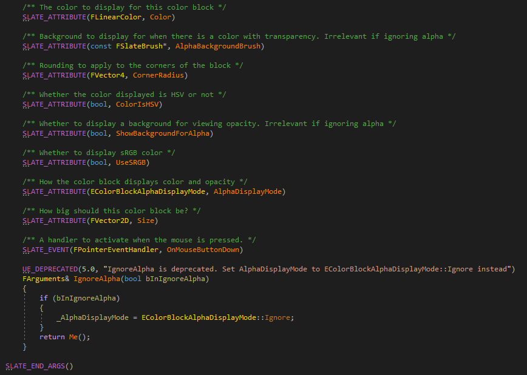
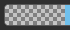
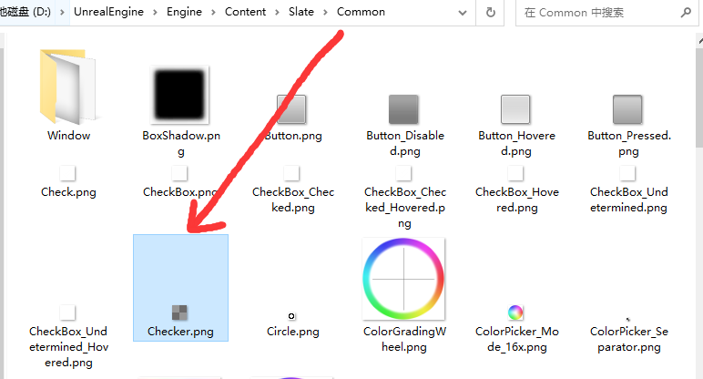
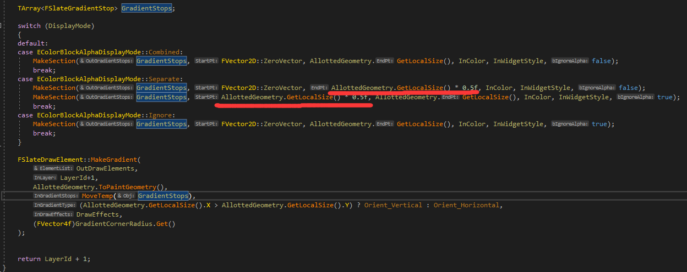
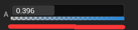

# SColorBlock

这个的用处很少，主要是这个。

这个主要是显示颜色，当点击它的时候，会打开颜色拾取器SColorPicker，SColorPicker是AppFrameWork模块下的，如果要在游戏模块下使用，需要进行移植，比如捏脸系统，可能需要颜色拾取器，可以参考SColorPicker下的代码。

它一般很少单独使用，都是配合SColorPicker使用的，但是SColorPicker比较复杂。

创建SColorBlock可以提供一些属性如下：

首先是Color，可以提供一个基础属性，第二个AlphaBackgroundBrush，这个画刷是个背景图，长这样：

它存放在这个文件夹下，当绘制的时候，**会调用图形API的纹理过滤选项，设置为平铺**，主要作用是显示颜色的透明度。

第三个选项CornerRadius表示颜色块的圆角半径，第四个选项表示是否显示颜色的透明度，第五个选项UseSRGB表示是否使用SRGB选项，如果不使用SRGB，默认直接把你提供的线性颜色值，比如0.8，直接乘以255，不然会做SRGB的处理，第六个选项表示颜色块的显示模式，有分离、合并、忽略3种，第一种就是默认方块背景板显示在左，颜色显示在右，第二种就是当透明度降低的时候，会显示底下的方块背景光板，第三种就直接忽略背景板。

然后是Size，这个主要用在ComputeDesiredSize里面，提供颜色块的大小，默认是16*16。

OnMouseButtonDown，鼠标点击的委托，一般都会挂一个打开SColorPicker的函数，当点击颜色块的时候，会打开颜色拾取器，编辑颜色。

ColorBlock不存储颜色，只是显示宿主的颜色，一般颜色都存放在逻辑里面，ColorBlock只是显示出来。

OnPaint函数里面则是把CololBlock绘制出来，根据颜色块的显示模式。

这里seperate的时候，会把来自父控件给予的控件分离成两半，还有一种就是Combined，会显示成如下的样子，会产生渐变效果，渐变效果可以看SSimpleGradient这个控件。

