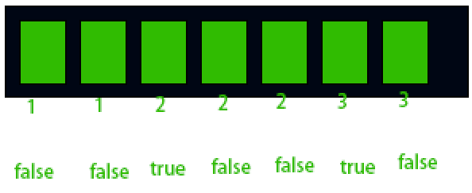

# SConstraintCanvas


这个控件最常用，子控件可以挂很多个。


它定义了一个FSlot类在SConstraintCanvas内部，然后这个FSlot从TSlotBase继承，TSlotBase可以在控件树的连接和SCompoundWidget查看。


槽的声明：

                                                                                                                                                                                                                                                                                                                                                                                                                                                                                                                                                                                                                                                                                                                                                                                                                                                                                                                                                                                                                                                                                                                                                                                                                                                                                                                                                                                                                                                                                                                                                                                                                                                                                                                                                                                                                                                                                                                                                                                                                                                                                                                                                                                                                                                                                                                               

它定义了一些属性，FMargin表示偏移(这里FMargin不表示边距)，FAnchors(锚点)，对齐(是个归一化值)，控制子槽的控件是否是固定大小，还有ZOrder(这个之后会转换为图元的Layer)。


UMG有一些预设，可以直接填充这些值。


然后SConstraintCanvas有一个TPanelChildren<FSlot>成员变量，这个模板类是类似TArray的东西，但是用来遍历子槽的，定义了一套类似数组的接口。


TPanelChildren从FChildren继承，然后持有一个TArray<TUniquePtr<SlotType>> Children，拥有一堆槽的所有权，然后定义了一套接口，用来遍历和访问槽内的SWidget。

比如：

```c++
virtual int32 Num() const override;//多少个槽

virtual TSharedRef<SWidget> GetChildAt(int32 Index) override;//访问第Index个SWidget

virtual TSharedRef<const SWidget> GetChildAt(int32 Index) const override;//访问第Index个SWidget

const SlotType& operator[](int32 Index) const;//访问第Index个槽

//还有添加槽、插入槽等函数
```


看到这里的，可以明白一个SWidget可以拥有很多槽，槽来持有子控件，是槽赋予了控件的布局概念，FChildren来提供了槽数组的接口。


```c++
SLATE_BEGIN_ARGS(SConstraintCanvas)

	SLATE_SLOT_ARGUMENT(FSlot, Slots)//这个宏定义了+运算符定义了一个TArray<typename SlotType::FSlotArguments>，可以添加任意的槽
SLAT_END_ARGS()
```


这里定义了一个SConstraintCanvas的参数类，这个参数类持有一个槽的TArray，到时候Construct里面直接触发移动到TPanelChildren<FSlot>里面。


## Construct

构建者模式的Construct，接受一个参数类FArguments


```c++
void SConstraintCanvas::Construct( const SConstraintCanvas::FArguments& InArgs )
{
	TArray<FSlot::FSlotArguments>& Slots = const_cast<TArray<FSlot::FSlotArguments>&>(InArgs._Slots);
    //根据ZOrder进行稳定排序槽
	auto SortOperator = [](const FSlot::FSlotArguments& A, const FSlot::FSlotArguments& B)
	{
		int32 AZOrder = A._ZOrder.Get(0);
		int32 BZOrder = B._ZOrder.Get(0);
		return AZOrder == BZOrder ? reinterpret_cast<UPTRINT>(&A) < reinterpret_cast<UPTRINT>(&B) : AZOrder < BZOrder;
	};
	Slots.StableSort(SortOperator);

	Children.AddSlots(MoveTemp(Slots));//直接触发移动语义，放置在TPanelChildren<FSlot>里面
}
```


Construct里面将槽根据ZOrder排了个序，然后移动到TPanelChildren里面。


它现在逻辑上的排列是这样的，相同的ZOrder会挨在一起，后续在OnPaint里面先排列好布局，然后再转换成Layer，生成图元。


## ComputeDesiredSize

计算固定的大小


```c++
FVector2D SConstraintCanvas::ComputeDesiredSize(float) const
{
	FVector2D FinalDesiredSize(0, 0);
	
	//遍历子槽
	for(int32 ChildIndex = 0; ChildIndex < Children.Num(); ++ChildIndex)
	{
		const SConstraintCanvas::FSlot& CurChild = Children[ChildIndex];//获取当前槽
		const TSharedRef<SWidget>& Widget = CurChild.GetWidget();//获取当前槽上的SWidget
		const EVisibility ChildVisibilty = Widget->GetVisibility();

		if ( ChildVisibilty != EVisibility::Collapsed )
		{
			const FMargin Offset = CurChild.GetOffset();//FMargin的left和top用于定义SWidget的左上角，right和bottom用于定义槽的固定大小
			const FVector2D Alignment = CurChild.GetAlignment();//这里没用到
			const FAnchors Anchors = CurChild.GetAnchors();//锚点

			const FVector2D SlotSize = FVector2D(Offset.Right, Offset.Bottom);

			const bool AutoSize = CurChild.GetAutoSize();//使用SWidget的固定大小，还是使用槽的大小

			const FVector2D Size = AutoSize ? Widget->GetDesiredSize() : SlotSize;

			const bool bIsDockedHorizontally = ( Anchors.Minimum.X == Anchors.Maximum.X ) && ( Anchors.Minimum.X == 0 || Anchors.Minimum.X == 1 );
			const bool bIsDockedVertically = ( Anchors.Minimum.Y == Anchors.Maximum.Y ) && ( Anchors.Minimum.Y == 0 || Anchors.Minimum.Y == 1 );

			FinalDesiredSize.X = FMath::Max(FinalDesiredSize.X, Size.X + ( bIsDockedHorizontally ? FMath::Abs(Offset.Left) : 0.0f ));
			FinalDesiredSize.Y = FMath::Max(FinalDesiredSize.Y, Size.Y + ( bIsDockedVertically ? FMath::Abs(Offset.Top) : 0.0f ));
		}
	}
}
```


假设锚点(菊花)定义在左上角，那么这个画板的固定大小等于(Left + SizeX, Top + SizeY)，等于这个紫色的矩形的大小。


## OnPaint && ArrangeLayeredChildren


```c++
int32 SConstraintCanvas::OnPaint( const FPaintArgs& Args, const FGeometry& AllottedGeometry, const FSlateRect& MyCullingRect, FSlateWindowElementList& OutDrawElements, int32 LayerId, const FWidgetStyle& InWidgetStyle, bool bParentEnabled ) const
{

	FArrangedChildren ArrangedChildren(EVisibility::Visible);
	FArrangedChildLayers ChildLayers;
    //排列子控件，将父控件的几何大小分配给所有子控件，这里定义了一个FArrangedChildLayers类，这个用来转换ZOrder为Layer所准备的东西
	ArrangeLayeredChildren(AllottedGeometry, ArrangedChildren, ChildLayers);

	const bool bForwardedEnabled = ShouldBeEnabled(bParentEnabled);

	int32 MaxLayerId = LayerId;
	int32 ChildLayerId = LayerId;

	const FPaintArgs NewArgs = Args.WithNewParent(this);

	for (int32 ChildIndex = 0; ChildIndex < ArrangedChildren.Num(); ++ChildIndex)
	{
		FArrangedWidget& CurWidget = ArrangedChildren[ChildIndex];

		if (!IsChildWidgetCulled(MyCullingRect, CurWidget))
		{
			if (ChildLayers[ChildIndex])
			{
				ChildLayerId = MaxLayerId + 1;
			}

			const int32 CurWidgetsMaxLayerId = CurWidget.Widget->Paint(NewArgs, CurWidget.Geometry, MyCullingRect, OutDrawElements, ChildLayerId, InWidgetStyle, bForwardedEnabled);

			MaxLayerId = FMath::Max(MaxLayerId, CurWidgetsMaxLayerId);
		}
		else
		{
			//SlateGI - RemoveContent
		}
	}

	return MaxLayerId;
}
```


这里可以看到，是逐一遍历槽内的控件，然后一个一个调用Paint函数去绘制，顺便求得整个画板的最大layer。


但是这里转换ZOrder为图元的Layer的东西是OnArrange里面做的，我们需要看一下这个操作。


布局控件有些特殊，它不需要更新属性，不需要走SWidget的ArrangeChildren函数，再去调用OnArrangeChildren函数，它直接定义了ArrangeLayeredChildren函数。


```c++
void SConstraintCanvas::ArrangeLayeredChildren(const FGeometry& AllottedGeometry, FArrangedChildren& ArrangedChildren, FArrangedChildLayers& ArrangedChildLayers) const
{
	//槽内是否有儿子
	if(Children.Num() > 0)
	{
		float LastZOrder = -FLT_MAX;//初始化一个浮点值的最小值
		
		//安排children，根据它们排序过的z-order，顺便分配布局空间
		for(int32 ChildIndex = 0; ChildIndex < Children.Num(); ++ChildIndex)
		{
			const SConstraintCanvas::FSlot& CurChild = Children[ChildIndex];//获取当前的槽
			const TSharedRef<SWidget>& CurWidget = CurChild.GetWidget();//获取槽上的SWidget
			
			const EVisibility ChildVisibility = CurWidget->GetVisibility();
			if (ArrangedChildren.Accepts(ChildVisibility))
			{
				const FMargin Offset = CurChild.GetOffset();
				const FVector2D Alignment = CurChild.GetAlignment();
				const FAnchors Anchors = CurChild.GetAnchors();
				
				//一大堆计算布局的操作...
				//...
				//把菊花锚点的很多情况都合并成一种通用的情况进行计算，然后加入FArrangedChildren数组
				ArrangedChildren.AddWidget(ChildVisibility, AllottedGeometry.MakeChild(				
					CurWidget,				
					LocalPosition,
					LocalSize
				));
				
				bool bNewLayer = true;
				if (bExplicitChildZOrder)
				{
					bNewLayer = false;
					//如果当前的ZOrder大于上一个的，那么表示会出现新的层，我们加入一个布尔值，放入ArrangedChildLayers
					if (CurChild.GetZOrder() > LastZOrder + DELTA)
					{
						if (ArrangedChildLayers.Num() > 0)
						{
							bNewLayer = true;
						}
						LastZOrder = CurChild.GetZOrder();
					}

				}
				ArrangedChildLayers.Add(bNewLayer);
			}
		}
	}
}
```


可以看到，ArrangedChildLayers是个布尔数组，如果其中某个元素为true，则表示新开一层，我们看看这个布尔数组是如何构造的：



true表示新开一层，然后我们在OnPaint里面从前往后，根据这个true，来增加Layer。


我们回头看一下之前的OnPaint：

```c++
if (ChildLayers[ChildIndex])
{
		ChildLayerId = MaxLayerId + 1;
}
```

如果父控件的Layer是5，我们使用上面那堆绿色控件做计算，最后得到的Layer就是7，这个会影响合批，如果我们相同ZOrder的图集弄成一样，它们的Layer也就相同。


