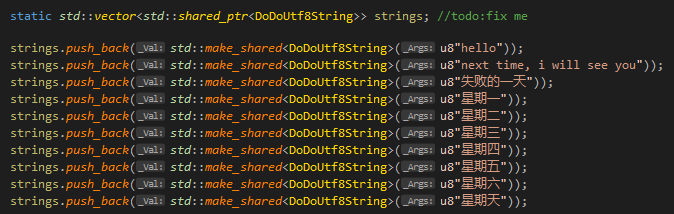

# SListView

这是一篇讲解slate的SListView控件的文章，SListView是一个**列表控件。**

## **SListView用法**

SListView的注释如下：

一个ListView控件观察着数据项的数组，并且创建这些项的可见的表达。(这个表示SListView是MVC形式的，它没有拥有数据，它只是观察着数据，**并且根据数据项去创建这些数据项的控件。**)

ListView依赖于属性，这个属性持有一个值的引用，并且这个值是必须存在的。换句话说，SListView<FString>、SListView<FString*>、SListView<FString>还有SListView<UObject*>都是可以用的，但是要保证有效，也就是数组里面的可以是指针，但是必须保证指针指向的数据是有效的，ListView不持有数组的所有权和生命周期，它只是读取这些数据，然后创建控件显示出来。

SListView的通常用法如下：

给定一个**TArrary<TSharedPtr<FString>> Items;**

**这个是字符串的智指针数组。**

**我们去创建一个SListView**

```
SNew(SListView<TShared_ptr<FString>>)
.ItemHeight(24)
.ListItemSource(&Items)//提供数据源
.OnGenerateRow(SListView<TSharedPtr<FString>>::MakeOnGenerateWidget(this, &MyClass::OnGenerateRowForList))//提供一个回调，这个回调会接受数据项的某个项，我们根据这个项去创建相应的控件
```

这个例子中，我们制作我们的控件24屏幕单位高度，也就是一个数据项的控件24高度。ListView将创建控件，基于在数组TArray中的数据项。当ListView需要去生成一个项的时候，它将使用我们提供的**OnGenerateWidgetForList**方法。

这段注释的意思说，我们创建ListView的时候，我们需要去提供数据项和处理单个数据项，并生成控件的**回调**。ListView会遍历我们的数据源数组，然后一个一个传入我们的回调，我们的回调创建好单个控件后，返回，然后ListView会将控件一个一个显示出来。

一个简单的OnGenerateWidgetForList的实现将简单地返回一个文本块在相应的文本。

```
TSharedRef<ITableRow> OnGenerateWidgetForList( TSharedPtr<FString> InItem, const TSharedRef<STableViewBase>& OwnerTable )
{
      return SNew(STextBlock).Text( (*InItem) )
}
```


比如我创建如上的ListView，我需要提供一个**字符串数组(数据源头)，然后提供一个回调，这个回调能根据一个数据，生成相应的控件。**




这是我的ListView，我提供了数据源，以及相应的回调方法。


这是我们的回调方法，这个回调方法接受一个数据项，以及一个STableViewBase，这个类是SListView的基类，还有个STreeView(树形视图)，但是为了通用性，使用它们的基类指针去绑定它们的派生类指针，所以为了回调的代码复用，这里使用了STableViewBase，把一些常见通用的功能放置在STableViewBase里面。

STableRow是表示一行的控件，它包裹着我们的控件，并且返回，STableRow起到的作用是提供单行数据项的能力，比如记录这个项在列表里面的索引，选择的高亮显示，在View和单个控件之间起通信等功能，并且具有**缩进**的功能(对于树形视图很有效)。

STableRow排列起来长这样，STableRow继承自ITableRow，提供一行所拥有的功能。


还有一个SMultiColumnTableRow类，这个是多列。


然后我们根据数据项，去创建一个带有颜色背景板的文本块**(绿紫颜色相替)**。这样ListView就能创建出我们的控件了。

SListView之所以是个模板，是因为如果我们提供UMaterial作为它的模板参数，就能在回调里面获取UMaterial的接口的贴图，然后创建一个SImage控件，并且返回，就能按序显示出来，具有强大的通用性和定制能力。

SListView在创建的时候，还可以指定一个SHeaderRow，**这个表示SListView的字段名称。**


```
SNew(SListView<TShared_ptr<FString>>)
.HeaderRow()//提供一个我们已经创建好的SHeaderRow
```

并且，我们可以提供一个方向，横向显示，只需要提供一个Orientation

```
SNew(SListView<TShared_ptr<FString>>)
.Orientation()//填入垂直和水平，默认是垂直逐行显示
```

我们可以提供一个外部的SScrollBar(滑动条)，就是放置在其他地方，一些定制化的滑动条，默认是在ListView的右边显示的，如果没有提供，Unreal会为我们去创建一个默认的SScrollBar。

```
SNew(SListView<TShared_ptr<FString>>)
.ExternalScrollbar()
```

## SListView布局和渲染流程


SListView、STreeView继承自这些类，STableViewBase主要是存放列表的一些通用功能(把SListView、STreeView的一些通用功能放置在这)，还有一个STileView，这个是平铺的View，是逐行一个一个摆放下来，而List则是一行一个，但是List也可以搭配SMultiColumnTableRow一行显示多个。


SExpanderArrow是STreeView使用的，是展开箭头。

SListView的Construct**至少需要提供数据源和针对单个数据源生成相应控件的回调。**


然后调用ConstructChildren，转发Construct的FArguments参数到另外一个函数进行构造。

ItemWidth只需要填入0，表示一个项的宽度是计算出来的，而ItemHeight则是我们需要提供的，

EListItemAlignment::LeftAligned表示项是以左对齐，还有SHeaderRow，这是字段名，可以提供，或者不提供，还有ExternalScrollbar，我们可以提供一个外部的Scrollbar，否则它会创建一个默认的Scrollbar，之后是方向，还有一个滚动偏移的回调，还有滑动条的风格。

进入到ConstructChildren之后，就是根据填入的参数，进行相应的控件树布局组织。

