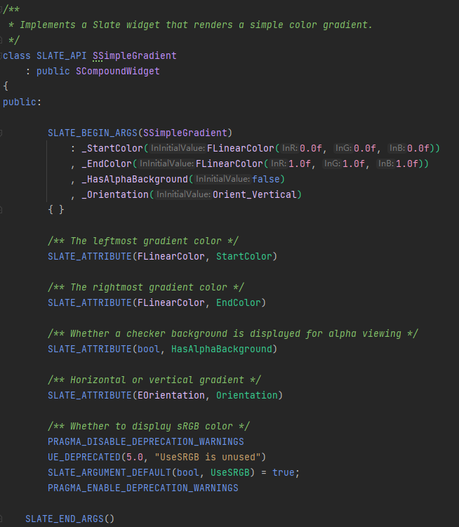
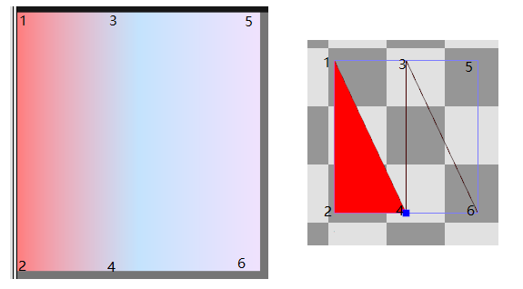
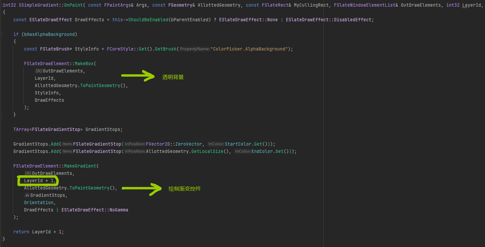
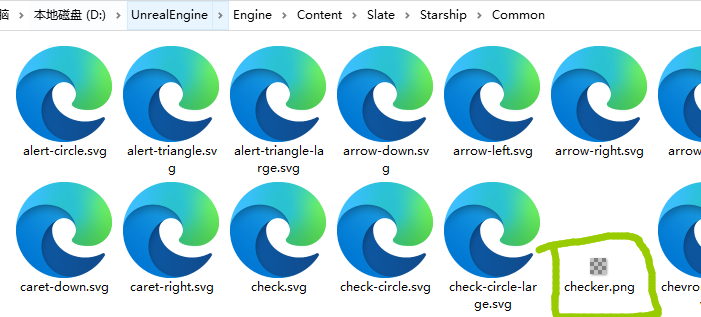
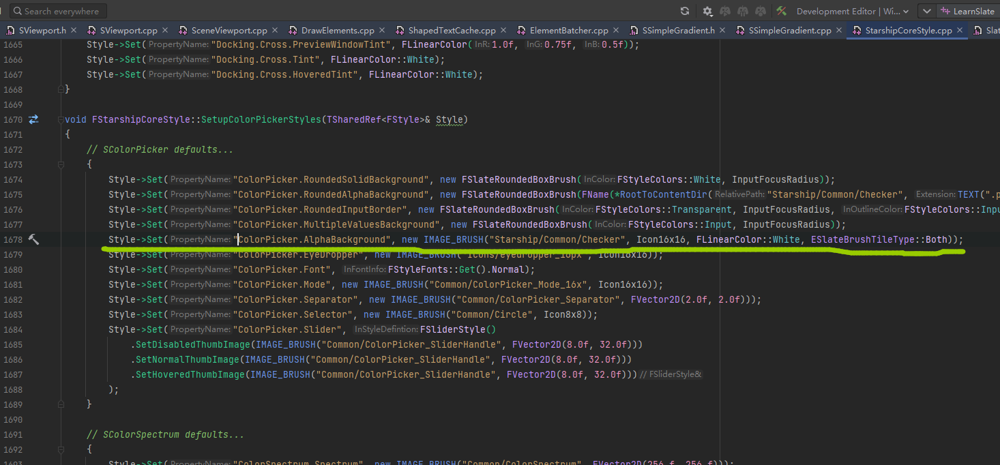

# SSimpleGradient

这个控件是简单颜色渐变控件。

这是这个类的声明截图，首先是SLATE_BEGIN_ARGS和SLATE_END_ARGS定义了SSimpleGradient的FArguments参数类，一个StartColor和EndColor，FLinearColor是线性颜色，范围在[0, 1]。

渐变颜色控件利用了硬件的一个特性，就是像素着色器的相邻顶点之间会插值顶点属性，Slate将SSimpleGradient的StartColor和EndColor放在三角形的相邻两个顶点之间。

这是示意图，渐变色控件，由4个三角形组成，相邻顶点之间会插值。

这个控件不是布局控件，不需要布局，所以没有重载OnArrange函数。

## OnPaint

FSlateDrawElement::MakeGradient会构造一个渐变图元，然后放置在OutDrawElements里面，然后层级+1，GradientStops放置两个颜色。

Orientation决定方向是垂直还是水平的。

构造顶点数据的顶点色可以在FSlateElementBatcher::AddGradientElement里面看看。

首先获取画刷，"ColorPicker.AlphaBackground"，这个是棋盘格贴图，长这样。

在这个文件夹下。

然后这个画刷是注册在这里，可以注意到它是ESlateBrushTitleType::Both，平铺的，也就是超过边界，平铺，会在渲染器里面调用进行状态的设置。

