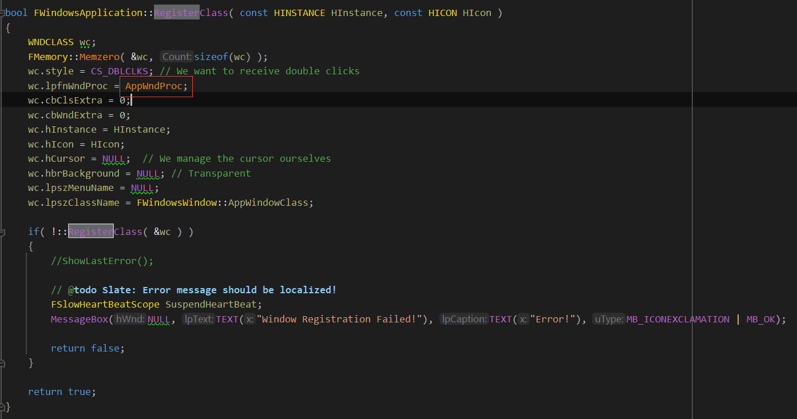

# SWindow以及窗口的创建

Slate的窗口

Slate的窗口控件是SWindow这个类，这个类创建的时候，书写方式如下：

```c++
SAssignNew(root_window, SWindow)
	.Title("hello") //标题
	.ClientSize(...) //窗口大小
	.ScreenPosition(...) //初始化的时候所在的屏幕位置
```


SAssignNew是个很长的宏，这个宏在Slate控件的创建过程和声明式语法里面有介绍。它最后会调用到SWindow的Construct函数，进行高度、宽度、标题、位置的一些初始化。然后后续，我们需要调用FSlateApplication的AddWindow去初始化SWindow所对应的平台窗口FGenericWindow。


FGenericWindow会根据所在平台，创建不同的平台子类窗口，如果是Windows，则会调用Win32的API去创建窗口，如果是Android，则是获取JNI的native window handle的指针。同时，还会去创建消息回调，操作系统的输入会派发给我们的应用。




消息回调的注册和窗口类的注册都在这里。


所有的消息处理都在这个函数里面，比如鼠标位置的派发，按键的输入等：

```c++
FWindowsApplication::ProcessMessage
```

