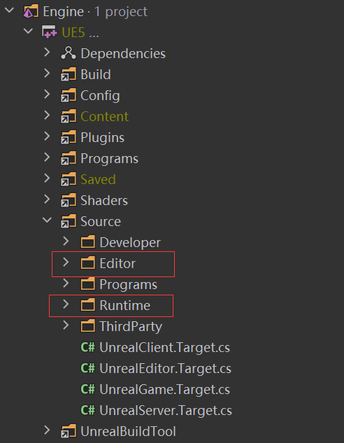

# Slate介绍

unreal的文档指出slate是虚幻引擎的自定义的UI编程框架。**编辑器的大部分界面都是使用Slate构建的。**

基本上每个可编辑的模块都是slate写的，一般一个模块会写一个运行时，然后再写一份用slate构建的编辑器代码，这块编辑器代码主要拿来保存运行时编辑好的资产、参数，如果想自己在unreal做一个模块，需要对slate非常熟练，但是相关文档很少介绍，一些项目如果对slate不熟，会使用一些三方UI库做工具，但是用三方的UI感觉契合的不大好，怪怪的。(感觉epic应该在设计每个界面的时候，都有类似相关的草图，指出每个UI元素的margin，大小，位置之类的，而且那块地方的代码量很大)。

这个文档主要是收集slate的各种资料以及详解slate的方方面面。
