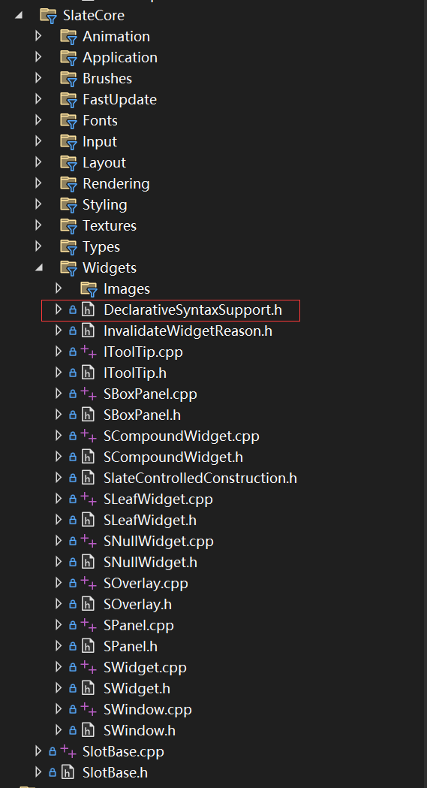
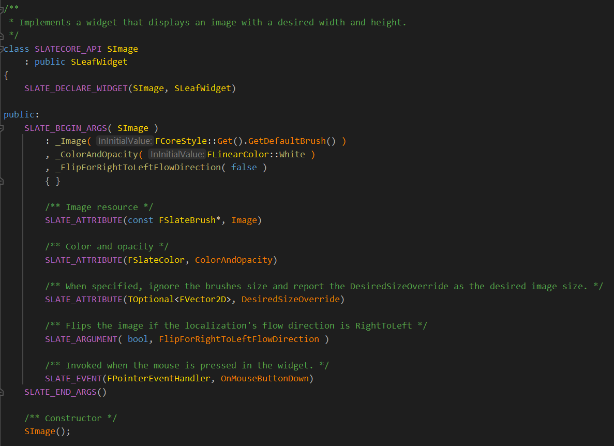

# Slate控件的创建过程和声明式语法


Slate是传统的面向对象的UI，**需要一开始就创建整棵UI的控件树**，这种叫做声明式的语法，先声明，后使用，还有一种是命令式的UI，这种UI，比如ImGui，它的每个函数根据传入的数据立马进行绘制，每个控件没有单独的实体，不需要像面向对象一样，先创建UI对象。


Slate模拟了一种声明式语法，模拟父子控件的嵌套和连接，便于书写，如果不使用slate的嵌套写法，会产生如下的情况：

```c++
std::shared_ptr<Button> button_1 = new Button();//button1
std::shared_ptr<Button> button_2 = new Button();//button2

button_1->add_child(button2);//添加儿子控件到父控件里面，这样操作的话，儿子控件会绘制到父控件上面
```

如果层级关系复杂，在代码层面是很难直观地表示整棵树的层级结构的。


Slate的嵌套语法在这个DeclarativeSyntaxSupport.h文件里面，这个文件名叫做**声明式语法支持**。它主要是写了一堆宏，重载了+和[]符号，+括号用来支持添加新控件到父控件的槽里面(槽主要是控件父控件和子控件之间的布局，以及起到连接和持有的作用，后续文章会描述)，[]括号则是让一个槽持有一个控件，父控件则可以持有一个或者很多槽，槽里面可以插满很多子控件。




## 一些常见的控件

控件有很多很多，还有很多复合控件，控件主要分为布局控件和基础控件。


最简单的控件是SImage，一张图，它没有槽，也就不能持有和挂载其它的控件。



首先，看一下这个类的定义，映入眼帘的是一些宏，SLATE_BEGIN_ARGS和SLATE_END_ARGS这两个宏比较重要，这个宏展开后，定义了一个FArguments类。

```c++
#define SLATE_BEGIN_ARGS(WidgetType) \
	public:\
	struct FArguments : public TSlateBaseNamedArgs<WidgetType> \
	{ \
		typedef FArguments WidgetArgsType; \
		FORCENOINLINE FArguments()

#define SLATE_END_ARGS() \
	};
```


SLATE_ATTRIBUTE、SLATE_ARGUMENT、SLATE_EVENT主要是定义了FArguments的一些成员变量，以及它们的委托绑定函数，主要是简化书写和用宏生成代码。

我们看一下SLATE_ATTRIBUTE这个宏：

```c++
#define SLATE_ATTRIBUTE(AttrType, AttrName) \
		SLATE_PRIVATE_ATTRIBUTE_VARIABLE(AttrType, AttrName); \
		SLATE_PRIVATE_ATTRIBUTE_FUNCTION(AttrType, AttrName)
```

这个宏由两个宏组成，属性变量和属性函数。


```c++
#define SLATE_PRIVATE_ATTRIBUTE_VARIABLE(AttrType, AttrName) \
		TAttribute<AttrType> _##AttrName;
```

这个宏定义了一个属性变量，TAttribute是个模板类，里面保存了一个委托成员，以及一个值，还有一个布尔变量表示这个委托是否绑定了，如果绑定了，从这个委托获取，否则用这个值。


SLATE_PRIVATE_ATTRIBUTE_FUNCTION则定义了一堆绑定其它函数到这个TAttribute变量的函数，因为Unreal有很多不同的函数，比如针对UObject的成员函数进行绑定，普通对象的成员函数绑定，静态函数的绑定，TFunction的绑定，这个宏，可以把这些冗余的代码一并生成。


为啥要把这些变量定义在FArguments类里面呢？而不直接定义在SImage里面呢？

因为SLATE比较聪明，使用了一种叫做**构建者模式**的设计模式，它先把这些存储在FArguments中，要赋值给控件的属性进一步组装，做一些额外的处理，才赋值给控件。


这个组装发生在构建一个控件的时候，使用的：

```c++
SNew(SImage)
	.Image(...)
	.ColorAndOpacity(...)
```


SNew这个宏做了很多处理，展开后，我们看一下结构：

```c++
#define SNew(WidgetType, ...)\
	MakeTDecl<WidgetType>(#WidgetType, __FILE__, __LINE__, RequiredArgs::MakeRequiredArgs(__VA_ARGS__)) <<=
	TYPENAME_OUTSIDE_TEMPLATE WidgetType::FArguments()
```

这里是构建者模式发生的地方，首先是WidgetType::FArgumemts()，这个是参数类的构造函数，我们首先通过Image和ColorAndOpacity将值赋值给它，然后通过重载的<<=转发给MakeTDecl这个函数进一步组装。


MakeTDecl这个模板函数主要是创建了一个TSlateDecl模板类：

```c++
template<typename WidgetArgsType, typename RequiredArgsPayloadType>
TSlateDecl<WidgetType, RequiredArgsPayloadType> MakeTDecl(const ANSICHAR* InType, const ANSICHAR* InFile,
int32_t OnLine, RequiredArgsPayloadType&& InRequiredArgs)
{
	return TSlateDecl<WidgetType, RequiredArgsPayloadType>(InType, InFile, OnLine, 
	Forward<RequiredArgsPayloadType>(InRequiredArgs));
}
```

这个函数的第一个参数，类型的字符串和第二个参数，文件名的字符串，只是用来debug用的，RequiredArgsPayloadType这个则是除了FArguments，用户如果想再传递一些参数给WidgetType这个类，则可以使用这个，比如

```c++
SNew(SButton, 3) //额外传递了一个3
```


这个TSlateDecl模板类，是一个构建者，它的构造函数创建了一个WidgetType对象，然后重载了<<=这个函数，掏取FArguments里面的参数值，进一步组装给这个WidgetType对象。


```c++
TSharedRef<WidgetType> operator<<=(const typename WidgetType::FArguments& InArgs) const
{
	_Widget->SWidgetConstruct(InArgs);
	_RequiredArgs.CallConstruct(_WidgetType, InArgs); //这里会调用每个控件类的Construct函数，同时把上面的payload放进去
	_Widget->CacheVolatility();
	_Widget->bIsDeclarativeSyntaxConstructionCompleted = true;//构造完毕
	
	return _Widget;
}
```


这里是构建者模式发生的地方，参数类，会转发给很多函数，**CallConstruct会调用widget的Construct函数。**


关注过slate的人，会发现，每个控件类除了定义构造函数外，还会顶一个Construct类，参数是FArguments。

我们看一下Simage：

```c++
void SImage::Construct( const FArguments& InArgs )
{
	ImageAttribute.Assign(*this, InArgs._Image);
	ColorAndOpacityAttribute.Assign(*this, InArgs._ColorAndOpacity);
	bFlipForRightToLeftFlowDirection = InArgs._FlipForRightToLeftFlowDirection;

	DesiredSizeOverrideAttribute.Assign(*this, InArgs._DesiredSizeOverride);

	SetOnMouseButtonDown(InArgs._OnMouseButtonDown);
}
```

在Construct这里，我们可以做很多操作，**在赋值FArguments的值给SImage的成员变量的时候。**


