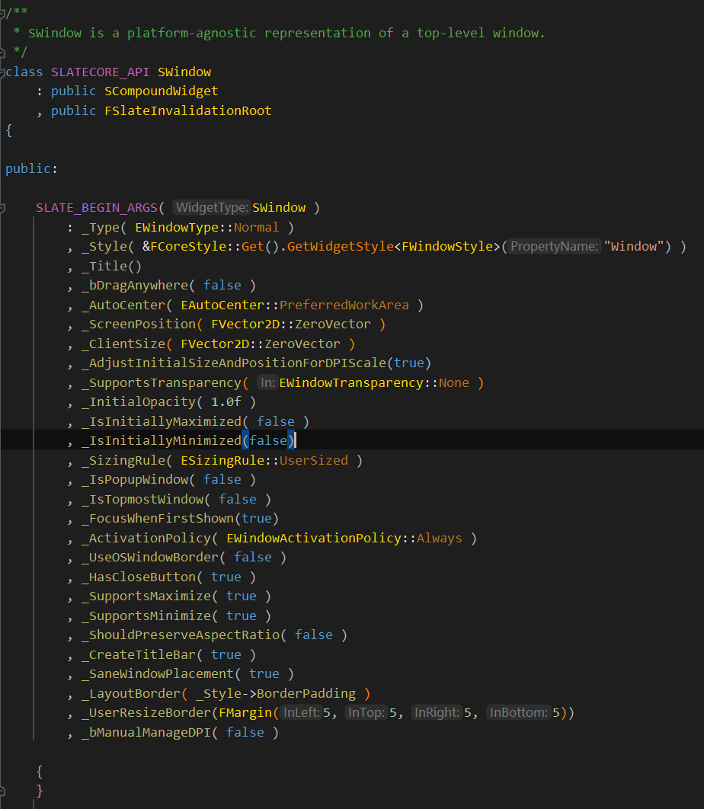

# Slate的渲染

Slate是逐窗口渲染，如果是手机的话，就只要画一个就行了。


窗口的创建，依赖于平台，在Windows和Mac上要根据操作系统的API创建，为了屏蔽这个差异性，Unreal使用FGenericWindow作为基类，然后从这个FGenericWindow派生不同平台的窗口子类，比如FWindowsWindow这个类，然后在其内部持有HWND，windows窗口系统的窗口句柄，我们在虚函数里面调用Win32的函数对这个窗口进行操作。


Slate有一个逻辑窗口类，以及相应的平台窗口类，逻辑窗口类是SWindow，也就是正常的控件，它持有一个

```c++
TSharedPtr<FGenericWindow> NativeWindow;//native window handle
```

这样做的目的是，为了让窗口这种依赖于平台的也和其它控件的创建和操作保持一致。



这是SWindow的参数类，里面有很多，比如窗口类型(普通的，弹出窗口，模态的)，还有风格(FWindowStyle)，标题，创建的时候是否居中，左上角位置，是否支持透明，初始的透明度，有很多很多属性。在Construct里面进行一些额外的处理，并且赋值完毕后。

之后，可以通过FSlateApplication的AddWindow函数来创建平台窗口。

```C++
virtual TSharedRef<SWindow> AddWindow( TSharedRef<SWindow> InSlateWindow, const bool bShowImmediately = true ) override;//这个bShowImmediately控制这个窗口是否立即创建RenderTarget，用于窗口的绘制
```


```c++
TSharedRef<SWindow> FSlateApplication::AddWindow(TSharedRef<SWindow> InSlateWindow, const bool bShowImmediately = true)
{
    //这个函数会排序，把这个窗口和之前打开过的窗口排个序，保持ZOrder，主要用于鼠标事件的穿透路由，从顶层窗口散播下去
	FSlateWindowHelper::ArrangeWindowToFront(SlateWindows, InSlateWindow);
    //创建平台窗口
	TSharedRef<FGenericWindow> NewWindow = MakeWindow( InSlateWindow, bShowImmediately );
    
    //立即创建back buffer，图形API需要传入native window的句柄，创建back buffer
    if(bShowImmediately)
    {
        InSlateWindow->ShowWindow();//这个函数会创建back buffer
        
        //设置焦点...
    }
    
    return InSlateWindow;
}
```


持续更新...


