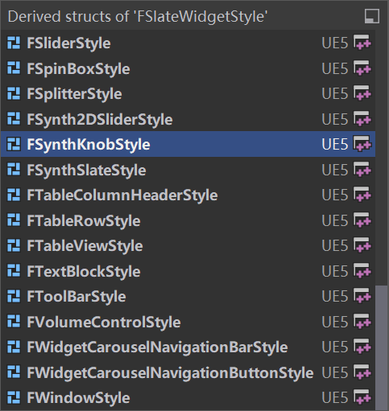
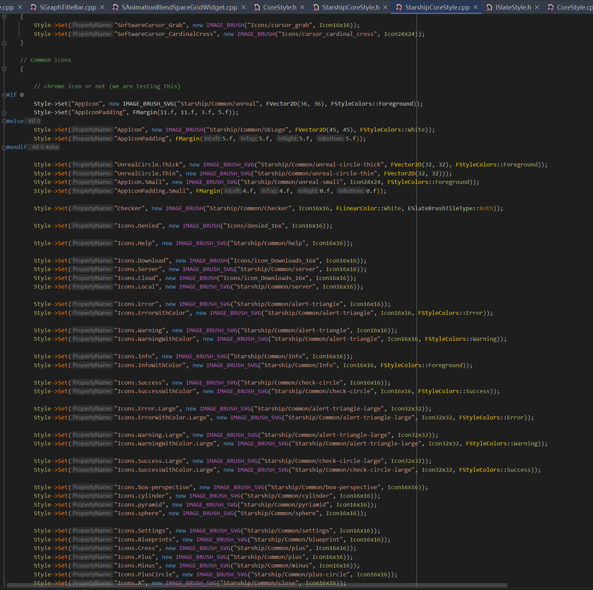

# Slate风格

在Web中有一种东西叫做css风格，这个用来描述一个控件的样式，Slate当中也有这个概念，如何表示一个控件的风格呢，Slate对风格做了进一步的抽象，我们来看一下风格的使用：

```c++
SAssignNew(ToolTip, SToolTip)
.BorderImage(FCoreStyle::Get().GetBrush("ToolTip.Background"));
```


首先，通过一个FCoreStyle的静态函数Get，获取这个FCoreStyle类的静态单例，然后获取它的画刷，GetBrush，传入了一个字符串。


Slate抽象风格和样式，样式是一堆图片以及描述这个控件的一些属性，比如按钮的圆角大小，图片路径，然后这一堆东西，再给它取一个名字，比如"ToolTip.Background"，这样的好处是，引用某个图片的时候，我们只需要这个名字即可，而不需要去使用完整的路径，而删除一个图片的时候，我们只需要在创建这个风格地方，改一处即可。


让我们看看风格类是如何抽象的，它是定义了一个叫做ISlateStyle的类，这个类派生了FSlateStyleSet类，FSlateStyle保存了一堆map。

字符串和FSlateWidgetStyle(这个是每个控件的样式，会针对每个控件创建不同的派生类，比如FTextBlockStyle)的关联，字符串和颜色的关联，字符串和文本信息的关联。


GetBrush则是根据"ToolTip.Background"查找map，拿到FSlateWidgetStyle，然后我们就可以赋值给控件了。


FSlateWidgetStyle有非常多非常多的子类，基础控件都会派生一个，每个控件风格类都保存了一大堆属性，比如圆角大小，图片大小，颜色等：



**每个模块的Initialize函数，如果是编辑器模块，我们书写的时候，可以为模块用到的控件创建自定义的风格，后续讲解怎么注册和定义自己的风格。**


这是StarshipCoreStyle.cpp下面的，注册了一堆风格，大概有4000多行，针对每个控件的风格，都手动硬编码了一套风格，图片路径通过IMAGE_BRUSH_SVG加上了前缀。


编辑器和一些普通样式基本上都是通过如下的方式注册风格的，手动进行硬编码，还有各个模块Initialize的时候，注册的风格。


引擎的内建资源只能通过这种方式进行处理，一行行写下去。




