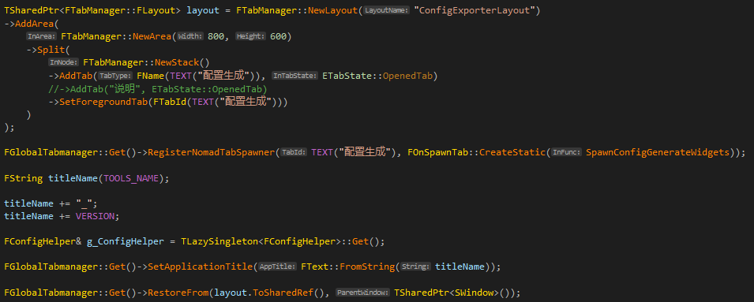
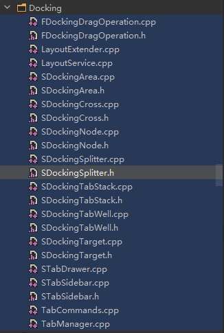
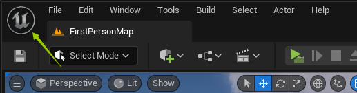
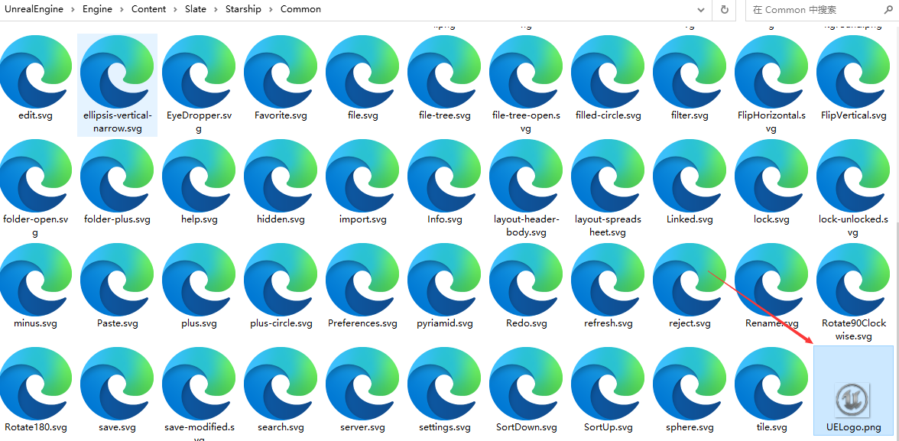
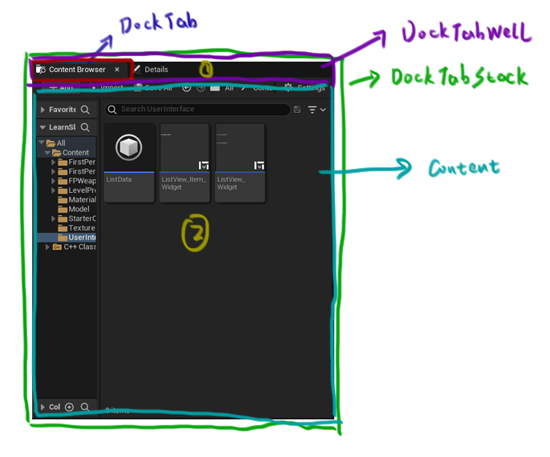

# 多窗口悬浮合并系列

这个系列绝对是大家最喜欢的系列，因为这个功能非常常见，像是IDE的多窗口悬浮合并，页签拖出来，形成一个新的窗口，这个是编辑器和一些桌面生产软件的核心功能，但是一般的软件都依赖三方UI库，如果是自绘的话，会很困难，网上对它的资料几乎没有，这篇文章会详细介绍多窗口页签的悬浮合并。


# 用法

unreal里面的每个模块，都使用了unreal封装的**多窗口悬浮合并功能，只要这个模块需要可视化编辑。**


每个模块基本上会在**StartupModule**里面进行编辑器的初始化，我们来看看关卡编辑器的初始化。


```c++
FGlobalTabmanager::Get()->RegisterTabSpawner("LevelEditor", FOnSpawnTab::CreateRaw(this, &FLevelEditorModule::SpawnLevelEditor))
.SetDisplayName(NSLOCTEXT("LevelEditor", "LevelEditorTab", "Level Editor"))
.SetAutoGenerateMenuEntry(false);
```

这是在LevelEditor(关卡编辑器)的StartupModule里面初始化的，也就是绑定一个页签和生成LevelEditor的回调，这个回调是FLevelEditorModule::SpawnLevelEditor，当我们点击页签(tab)的时候，会显示相应的编辑器，然后我们的页签LevelEditor可以设置相应的显示名字，还可以设置Icon等功能，FGlobalTabManager提供了很多接口让我们用。


我们看一下FOnSpwanTab这个回调，每个带编辑器的模块都用了这个。


```c++
DECLARE_DELEGATE_RetVal_OneParam(TSharedRef<SDockTab>, FOnSpawnTab, const FSpawnTabArgs&);
//定义了一个委托叫做FOnSpawnTab，参数是FSpawnTabArgs&，返回值是TSharedRef<SDockTab>
```


SDockTab就是小页签，我们看一下FLevelEditorModule::SpawnLevelEditor这个函数：

```c++
TSharedRef<SDockTab> FLevelEditorModule::SpawnLevelEditor(const FSpawnTabArgs& InArgs)
{
	//创建一个页签
	TSharedRef<SDockTab> LevelEditorTab = SNew(SDockTab)
	.TabRole(ETabRole::MajorTab)
	.ContentPadding(FMargin(0))
	.IconColor(FAppStyle::Get().GetColor("LevelEditor.AssetColor")); //提供一个小画刷作为Icon的颜色
	
	LevelEditorTab->SetTabIcon(FAppStyle::Get().GetBrush("LevelEditor.Tab"));//提供一个小画刷作为Icon
	
    //省略一堆噪音，留下精华，这里创建了了关卡编辑器
    TSharedPtr<SLevelEditor> LevelEditorTmp;//创建一个SLevelEditor
	LevelEditorTab->SetContent(SAssignNew(LevelEditorTmp, SLevelEditor));//在页签SDockTab的数据成员里面保存SLevelEditor
	SetLevelEditorInstance(LevelEditorTmp);
	LevelEditorTmp->Initialize(LevelEditorTab, OwnerWindow.ToSharedRef());
}
```


SLevelEditor就是Unreal的各种编辑场景数据的地方，如果有项目需要自定义，可以修改这个类。


SDockTab的SetContent不会把SLevelEditor这个关卡编辑器挂在自己的控件槽下，每个SDockTab只会保存相应的控件到它们的数据成员里面，挂到控件槽下，就意味着渲染遍历控件树的每个控件，并进行渲染。这意味着，当我们点击每个SDockTab，我们就要修改控件树，把点击到的SDockTab保存的SLevelEditor挂到控件树下，这样就能渲染了，我们看看SDockTab的OnMouseButtonDown函数：

```c++
FReply SDockTab::OnMouseButtonDown( const FGeometry& MyGeometry, const FPointerEvent& MouseEvent )
{
	//我只保留了这个，这个就是非常重要的函数，当点击SDockTab的时候，切换子树的挂载
	ActivateInParent(ETabActivationCause::UserClickedOnTab);
}

void SDockTab::ActivateInParent(ETabActivationCause InActivationCause)
{
	TSharedPtr<SDockingTabWell> ParentTabWell = ParentPtr.Pin();//我们获取管理SDockTab的SDockingTabWell
	if (ParentTabWell.IsValid())
	{
		ParentTabWell->BringTabToFront(SharedThis(this));//挂载这个SDockTab保存的Content
	}
	//当激活页签的时候，会触发页签激活的回调，我们可以绑定一个
	OnTabActivated.ExecuteIfBound(SharedThis(this), InActivationCause);
}
```


SDockingTabWell是什么呢？SDockingTabWell管理和控制页签的关闭和打开，还有布局页签，进行绘制。



这是我的独立应用(unreal可以写独立应用，比如配置导出工具)如何使用页签布局的地方，Unreal不直接使用SDockingTabWell、SDockTab、SDockingSplitter等能渲染和操控实际页签逻辑的控件，因为slate不能序列化和保存布局，所以unreal创建了一些类，这些类能保存布局进行序列化，下次打开编辑器的时候，再还原出来，它们一一对应，比如FTabManager::FLayout，FTabManager::NewArea创建出来的SDockingArea，FTabManager::NewStack创建出来的SDockingTabStack，相当于一张草图，然后我们把这个草图喂到RestoreFrom这个函数里面，RestoreFrom就会创建各式各样的控件，把这个复杂的过程省略了。




FLayoutNode是FStack、FArea、FSplitter的基类，FLayout是容纳它们的容器，相当于一张可以序列化的草图，还有FTab，FTab就是代表SDockTab，FArea代表窗口，FStack是FTab的数组，FSplitter是分割线，它们有相应的插入、删除FTab的接口，我们可以任意增加页签。


```c++
AddArea(FTabManager::NewArea(800,600))//创建一个窗口，800x600像素宽度的FArea

//FArea有Splitter接口，Split，添加一个分割线，可以拉动的
Split(
	FTabManager::NewStack(
		->AddTab(FName("配置生成",ETabState::OpenedTab))//添加一个FTab
		->SetForegroundTab("配置生成")//设置这个Tab是第一个显示的
	)
);
```


FStack可以任意AddTab，添加一堆FTab，FStack是FTab的数组。


RegisterNoamedTabSpanwer，**我们可以绑定一个FTab和相应的回调函数，这个回调函数就是刚刚讲的，生成在点击这个页签下生成的显示内容。**

FGlobalManager管理者一个Map，这个Map保存着FTab和绑定着回调的委托，到时候，它RestoreFrom遍历FLayout这个草图的时候，就会查询相应的Map，然后创建它们对应的控件。


整个程序左上角的Unreal Icon，感兴趣的可以换掉，换成自己的。



这个的替换在SAppIconWidget，它会调用FSlateApplicationBase::Get().GetAppIcon()获取这个画刷，然后贴上去。


这个文件的路径在这，我们可以替换掉，换成我们的图标。





DockTabStack分为两部分，黄色的1和2，由DockTabWell和Content(SDock要显示的内容)两部分组成，DockTabWell显示DockTab数组，当我们点击DockTabWell里面的DockTab的时候，DockTabStack会切换黄色的2部分的内容，挂载到它的子控件下。


SDockTab在它的数据成员里面保存了内容，但是它没有挂到自己的子控件下，而是挂到整体外层的绿色DockTabStack子控件下。


那DockArea是啥，DockArea比较特殊，它继承自DockSplitter，DockSplitter拥有分割线，可以放置很多很多DockTabStack，DockArea是拥有窗口的DockSplitter。


DockArea拥有一个窗口，当我们的GlobalManager创建它的时候，会调用SetParentWindow，给予它一个SWindow，并把DockArea挂在它的子控件下，然后

调用FSlateApplication::Get().MakeWindowTitleBar()创建一个带有关闭按钮，缩放按钮、UELog的标题栏，我们就能改成我们的商标了。


# 补充

我们来看看内容浏览器的创建吧，怎么和dock结合起来的。


首先，每个编辑器模块在StartupModule里面创建的：

```c++
void FContentBrowserModule::StartupModule()
{
	IContentBrowserDataModule::Get();

	//创建一个内容浏览器单例
	ContentBrowserSingleton = new FContentBrowserSingleton();
}
```


内容浏览器单例它有个函数，**SpawnContentBrowserTab**，然后创建一个SBox(盒子控件)，再创建一个SContentBrowser，然后把它放进SBox，然后创建一个SDockTab，把SContentBrowser放进SDockTab的数据成员Content下，调用SetContent，到时候点击的时候，把它显示出来。


各种编辑资产的活都在SContentBrowser下，说到这，你应该明白了什么，也就是之前提到的SLevelEditor它是调用UE的渲染模块渲染完一张场景，然后贴到一个控件上，就形成了视口，SLevelEditor持有SLevelViewport，SLevelViewport持有一个SViewport，这个SViewport调用OnPaint的时候，会调用MakeViewport，去创建一个Image控件，然后把之前的场景的着色器资源视图shader resource view绑定到这个控件上进行绘制，就享有了它的位置布局信息。


我们可以改动SContentBrowser，检测放进去的资产的大小之类的。


GameViewportClient就是协调渲染模块和Slate的，GameViewportClient的Draw函数，里面会调用渲染模块去渲染场景，然后贴到SViewport这个控件上。


持续更新...


