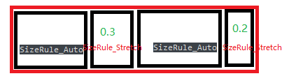

# 布局计算

## ComputeDesiredSize


保留绘制模式的UI计算布局，需要两次递归，一次是自顶向上计算固定的大小，一次是自上而下分配控件的大小给子控件，这是因为当控件的属性指定为填充的时候，会铺满父控件的槽，否则则使用自身的固定大小，比如图片可以要求填充或者本身的大小。


这是slate文档的描述，只有几句话，经过我的试验，重新写了一遍，Cache Desired Size(存储期望的大小)，这个就是固定大小，Compute Desired Size计算完毕后，调用Cache Desired Size，然后保存起来，待到Arrange Children分配布局的时候，如果SWidget指定为固定大小，那么就使用固定大小，否则使用填充，填充整个槽。


这是计算固定大小的流程，在我照抄的Slate UI里面，它是遍历每个窗口，每个窗口一个控件树，从每个窗口开始递归计算固定大小，然后先计算子控件的固定大小，然后加起来，计算父控件的固定大小，**ComputeDesiredSize**是个虚函数，根据不同的SWidget进行重载。


我们看一下SImage的ComputeDesiredSize，SImage除了图片的固定大小，我们还能指定相应的固定大小。

```c++
FVector2D SImage::ComputeDesiredSize(float) const
{
	const FSlateBrush* ImageBrush = ImageAttribute.Get();//获取画刷上的图片
    
    //如果SImage指定了固定大小，那就使用固定大小，否则使用图片的固定大小
	if(ImageBrush != nullptr)
    {
        const TOptional<FVector2D>& CurrentSizeOverride = DesiredSizeOverrideAttribute.Get();
        
        return CurrentSizeOverride.IsSet() ? CurrentSizeOverride.GetValue() : ImageBrush->ImageSize;
    }
    return FVector2D::ZeroVector;
}
```


SWidget的绘制和布局都在Tick的最后面调用，UObject的逻辑处理都在前面，但是有时候UObject要获取UMG的控件的固定大小，但是此时还没算出来，或者是使用的上一帧的固定大小，调用SlatePrepass可以解决这个问题，不要太担心这个函数的性能，因为这个函数是递归算的，如果控件是很顶层，靠近屏幕的，只会算几层，就停下来。


我们看看SOverlay的ComputeDesiredSize。

SOverlay是层叠控件，它的固定大小是这样计算的：

```c++
FVector2D SOverlay::ComputeDesiredSize( float ) const
{
	FVector2D MaxSize(0,0);
    //直接遍历所有的槽，求固定大小的最大值
	for ( int32 ChildIndex=0; ChildIndex < Children.Num(); ++ChildIndex )
	{
		const FOverlaySlot& CurSlot = Children[ChildIndex];
		const EVisibility ChildVisibilty = CurSlot.GetWidget()->GetVisibility();
		if ( ChildVisibilty != EVisibility::Collapsed )
		{
			FVector2D ChildDesiredSize = CurSlot.GetWidget()->GetDesiredSize() + CurSlot.GetPadding().GetDesiredSize();
			MaxSize.X = FMath::Max( MaxSize.X, ChildDesiredSize.X );
			MaxSize.Y = FMath::Max( MaxSize.Y, ChildDesiredSize.Y );
		}
	}

	return MaxSize;
}
```


它是这样的一个控件，红色框框是SOverlay，里面有两个控件SWidget1和SWidget2，一个叠在另一个身上，根据Widget在槽里面的顺序。


每个控件都会计算固定大小，根据它所重载的ComputeDesiredSize函数。


## ArrangeChildren

计算布局，这个是最重要的，这个会调用每个控件的虚函数OnArrangeChildren。


这个和Paint/OnPaint一样，ArrangeChildren不是虚函数，不会直接调用OnArrangeChildren，ArrangeChildren是SWidget基类的函数，OnArrangeChildren则由每个SWidget重载，


至于为啥这么做，因为虚函数的调用比较耗时，slate把控件的相同计算放置在非虚函数ArrangeChildren里面，再去调用OnArrangeChildren，处理不同控件的布局，Unreal很多东西都这么操作，比如类的继承，把一些公共的东西放在一起。


这个函数首先更新控件的所有属性，如果这个属性是可见的话，TSlateAttribute或者TAttribute这种，从委托的回调函数里面拿值，然后再调用虚函数OnArrangeChildren，分配具体的大小。


我们看一下SLeafWidget的OnArrangeChildren虚函数，这个是SImage的父类：

```c++
void SLeafWidget::OnArrangeChildren( const FGeometry& AllottedGeometry, FArrangedChildren& ArrangedChildren ) const
{
	// Nothing to arrange; Leaf Widgets do not have children.
}
```

因为SImage是叶子控件类型的，它没有槽，也不需要计算布局，所以这里是空的。


我们看一下经典的水平盒子布局SHorizontalBox类，它的OnArrangeChildren函数，这里，Slate将SHorizontalBox从SBoxPanel(盒子画板)类继承，然后重写了SHorizontalBox的OnArrangeChildren函数，针对水平和垂直分别调用不同的函数。


```c++
void SBoxPanel::OnArrangeChildren( const FGeometry& AllottedGeometry, FArrangedChildren& ArrangedChildren ) const
{
	if ( this->Orientation == EOrientation::Orient_Horizontal )
	{
        //计算水平方向的布局，将父控件的AllottedGeometry分配给所有子控件
		ArrangeChildrenAlong<EOrientation::Orient_Horizontal>(GSlateFlowDirection, this->Children, AllottedGeometry, ArrangedChildren );
	}
	else
	{
        //计算垂直方向的布局，将父控件的AllottedGeometry分配给所有子控件
		ArrangeChildrenAlong<EOrientation::Orient_Vertical>(GSlateFlowDirection, this->Children, AllottedGeometry, ArrangedChildren );
	}
}
```

AllottedGeometry是当前SBoxPanel的可分配大小，我们可以分配给它的子槽里面的所有控件，分配完毕后，存储在FArrangedChildren(已经分配的儿子)里面。


我们先介绍这两个类，FGeometry和FArrangedChildren，这两个，控件的几何信息，还有已经分配了几何信息的控件。


这两个对象是递归派发的，一开始是在SWindow的PaintSlowPath里面获取的，然后一路递归下去。

```c++
int32 SWindow::PaintSlowPath(const FSlateInvalidationContext& Context)
{
	HittestGrid->Clear();

	const FSlateRect WindowCullingBounds = GetClippingRectangleInWindow();
    //获取当前窗口的Layer，为0，最小的
	const int32 LayerId = 0;
    //获取当前窗口的几何信息，比如大小为1024 * 720
	const FGeometry WindowGeometry = GetWindowGeometryInWindow();

	int32 MaxLayerId = 0;

	//OutDrawElements.PushBatchPriortyGroup(*this);
	{
		//一路分配下去
		MaxLayerId = Paint(*Context.PaintArgs, WindowGeometry, WindowCullingBounds, *Context.WindowElementList, LayerId, Context.WidgetStyle, Context.bParentEnabled);
	}

	//OutDrawElements.PopBatchPriortyGroup();


	return MaxLayerId;
}
```

### FGeometry

这个类表示一个Widget的位置，大小，还有绝对位置在Slate中，注释这样描写到，总共5个属性比较重要，盘点一下：

```c++
const FVector2D Size;//大小

const float Scale;//缩放

const FVector2f AbsolutePosition;//绝对位置，以屏幕左上角为起点

const FVector2f Position;//相对位置，相对于父控件的坐标系

FSlateRenderTransform AccumulatedRenderTransform;//把上面的几个属性拼成一个矩阵的一个类
```

FGeometry里面的东西比较复杂，但是它的属性是比较简单的，FSlateRenderTransform表示数学概念上的变换，是一个2x2的矩阵。

在TransformCalculus2D.h这个头文件里面，定义了二维控件的很多类，比如FScale2D，FQuat2D，FTransform2D等，定义了很复杂的模板，去支持它们这些类可以互相连接起来，在Concatenate这个函数，比如一个缩放乘以一个旋转。


OnArrangeChildren用到这个参数，放在参数里面用以递归，主要是为了递归分配几何大小，比如一个大小的高度为4，分配给两个控件，垂直布局，那么这两个控件的高度大小则为2。


### FArrangedChildren

已经分配了几何信息的Children。


这个是个控件的数组，但是还存放了每个控件已经分配好的FGeometry几何信息。


FArrangedChildren，有一套类似数组的接口，可以看看，然后它有个FArrangedWidgetArray成员，就是FArrangedWidget的TArray。

FArrangedWidget就是分配好几何信息的SWidget，存了一个SWidget的共享指针以及一个FGeometry。


在调用OnArrangeChildren的时候，**把分配好布局的SWidget放入FArrangedWidget。**


我们来看看SBoxPanel的OnArrangeChildren函数里面的ArrangeChildrenAlong函数。


```c++
template<EOrientation Orientation, typename SlotType>
static void ArrangeChildrenAlong(EFlowDirection InLayoutFlow, const TPanelChildren<SlotType>& Children,
const FGeometry& AllottedGeometry, FArrangedChildren& ArrangedChildren)
{
	//开始分配
    
    //分配的控件将被给予固定大小的children第一步
    //剩下的控件将根据比例分配给拉伸的儿子(SizeRule_Stretch)
    //基于它们拉伸的因子
    if(Children.Num() > 0) //排列槽里面的widget，放入FArrangedChildren
    {
        float StretchCoefficientTotal = 0;//拉伸因子的和
        float FixedTotal = 0;//固定大小的和
        
        bool bAnyChildVisible = false;
        
        //计算固定大小widgets的拉伸因子的和(SizeRule_Auto)
        for(int32_t ChildIndex = 0; ChildIndex < Children.Num(); ++Children)
        {
            const SlotType& CurChild = Children[ChildIndex];
            
            if(CurChild.GetWidget()->GetVisibility() != EVisibility::Collapsed)
            {
                //对于拉伸的儿子，我们统计拉伸因子
                StretchCoefficientTotal += CurChild.GetSizeValue();
            }
            else
            {
                FVector2D ChildDesiredSize = CurChild.GetWidget()->GetDesiredSize();
                
                //自动缩放的儿子贡献它们的固定大小到固定空间的需求
                const float ChildSize = (Orientation == Orient_Vertical)
                    ? ChildDesiredSize.Y
                    : ChildDesiredSize.X;
                
                //限制大小，如果提供了限制大小的话
                float MaxSize = CurChild.GetMaxSize();
                FixedTotal += MaxSize > 0 ? FMath.Min(MaxSize, ChildSize) : ChildSize;
            }
        }
    }
    
    if(!bAnyChildVisible)
    {
        return;
    }
    
    //计算剩余非固定大小空间总和
    const float NonFixedSpace = FMath::Max(0.0f, (Orientation == Orient_Vertical)
                                           ? AllottedGeometry.GetLocalSize().Y - FixedTotal
                                           ? AllottedGeometry.GetLocalSize().X - FixedTotal);
    float PositionSoFar = 0;
    
    //遍历槽
    for(TPanelChildrenConstIterator<SlotType> It(Children, Orientation, InLayoutFlow); It; ++It)
    {
        const SlotType& CurChild = *It;
        const EVisibility ChildVisibility = CurChild.GetWidget()->GetVisibility();
        
        //计算当前这个widget的宽度或者高度
        float ChildSize = 0;
        if(ChildVisibility != EVisibility::Collapsed) //不是折叠的
        {
            if(CurChild.GetSizeRule() == FSizeParam::SizeRule_Stretch)
            {
                ChildSize = NonFixedSize * CurChild.GetSizeValue() / StretchCoefficientTotal;
            }
            else
            {
                const FVector2D ChildDesiredSize = CurChild.GetWidget()->GetDesiredSize();
                
                //auto-sized的widgets获取它们固定的大小
                ChildSize = (Orientation == Orient_Vertical)
                    ? ChildDesiredSize.Y
                    : ChildDesiredSize.X;
            }
        }
		
        //计算边缘部分
        const FMargin SlotPadding(LayoutPaddingWithFlow(InLayoutFlow, CurChild.GetPadding()));
        
        FVector2 SlotSize = (Orientation == Orient_Vertical)
            ? FVector2D(AllottedGeometry.GetLocalSize().X, ChildSize + SlotPadding.template GetTotalSpaceAlong<Orient_Vertical>)
            : FVector2D(ChildSize + SlotPadding.template GetTotalSpaceAlong<Orient_Horizontal>(),
              AllottedGeometry.GetLocalSize().Y);
        
         AlignmentArrangeResult XAlignmentResult = AlignChild<Orient_Horizontal>(InLayoutFlow, SlotSize.X, CurChild, SlotPadding);
		AlignmentArrangeResult YAlignmentResult = AlignChild<Orient_Vertical>(SlotSize.Y, CurChild, SlotPadding);

		const FVector2D LocalPosition = (Orientation == Orient_Vertical)
				? FVector2D(XAlignmentResult.Offset, PositionSoFar + YAlignmentResult.Offset)
				: FVector2D(PositionSoFar + XAlignmentResult.Offset, YAlignmentResult.Offset);

		const FVector2D LocalSize = FVector2D(XAlignmentResult.Size, YAlignmentResult.Size);
        
        //计算好布局后，我们放入ArrangedChildren数组
        ArrangedChildren.AddWidget(ChildVisibility, AllottedGeometry.MakeChild(
        	CurChild.GetWidget(),
            LocalSpace,
            LocalPosition
        ));
        
        if(ChildVisibility != EVisibility::Collapsed)
        {
            PositionSoFar += (Orientation == Orient_Vertical) ? SlotSize.Y : SlotSize.X;
        }
    }
}
```

Slate的代码太晦涩了，这里就是遍历画板的槽，从槽里面获取控件，暂时忽略padding(填充)，然后分配父控件的几何信息给它们。



红色的是父控件，首先统计固定大小(SizeRule_Auto)的水平总和，然后统计拉伸控件(SizeRule_Stretch)的因子总和，固定大小使用的是第一次递归SlatePrepass提供的固定大小，然后计算每个黑色控件的水平宽度，先把固定大小的控件大小给减去，然后剩余的控件分配给拉伸的控件。


```c++
//假设红色控件的宽度是1400
//两个SizeRule_Auto的固定大小是400和500
//留给拉伸控件的宽度就是1400 - 400 - 500 = 500，然后根据拉伸因子进行分配

500 / (0.3 + 0.2) * 0.3 = 300
500 / (0.3 + 0.2) * 0.2 = 200
```


## 槽

每个布局控件都会定义槽类，让槽来持有子控件，槽还携带padding，对齐等信息。

比如垂直盒子，定义了一个FSlot类，然后继承自SBoxPanel::TSlot<FSlot>，这里使用了奇异递归模板模式，这里主要是为了增加静态接口，[CRTP好处](https://www.jianshu.com/p/50f2528989d4)。


整个继承是这样的，很长，比较晦涩，其实就是一个持有SWidget智能指针(拥有所有权)的类，然后如果是裸指针，一般是只读的，没有所有权。


TPaddingWidgetSlotMixin和TAlignmentWidgetSlotMixin只是存了一些枚举值和边缘的填充值，还有设置这些值的接口。


然后SBoxPanel有个槽数组，TPanelChildren<FSlot>，这个就是FSlotBase的Owner指针，这里也使用了CRTP，Unreal使用了非常多的CRTP，TPanelChildren拥有一套数组接口，用来遍历槽的，在OnArrangeChildren里面遍历每个槽的控件，分配具体的布局，再放入FArrangedArray数组。


还有计算布局的调用链是这样的：


这里从SWindow的PaintSlowPath开始的，还有个PaintFastPath，这个是单独的游戏的时候开启的，会开启很多优化，慢路径是编辑器模式下的，所有控件每一帧都会重新生成，不会做cache。


声明式语法和对应控件树的示意图，+就是在TPanelChildren之类的槽数组里面加槽，[]表示给TSlotBase的SWidget智能指针赋值。


