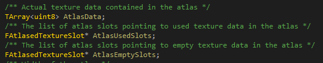

# 文本

## 文本实现的概述
文本框和文本编辑框的实现很复杂，涉及到多个方面。涉及到字体文件的读取，字体图集的存储，字体的渲染，渲染的字体的排版、塑形。这些涉及到三个公用库，freetype、harfbuzz、icu。freetype负责字体文件的读取和转换为像素数据，harfbuzz负责字体的塑形，调整每个字之间的间隔，而icu负责断词断句以及语言本地化。

## 字体文件的读取
FSlateFontInfo表示字体文件相关的信息，后续freetype会获取这个FSlateFontInfo里面的字体文件名和字体大小去加载具体的字体文件。

FSlateFontInfo的字体可以是来自编辑器资产UAsset(这个是从ttf先转换到UAsset)，也可以是直接从硬盘上加载ttf，都是一样的，我们讲解ttf就可以，ttf文件名使用FCompositeFont存储，
FSlateFontInfo存储了一个FCompositeFont，这个FCompositeFont存了很多东西，但是其实只有文件名最重要。

然后是最关键的Size，字体大小用一个实际的物理尺寸描述，点(point)，1点表示1/72英寸，然后假定了设备的分辨率是96 dpi，即每英寸的像素数，所以一个字体的像素大小则是
字体点数(point) / 72英寸 * 96 dpi 即是像素数，为什么要假定设备分辨率？因为计算机实际上是不知道自己显示器的尺寸的，但是windows的设置上有个调节比例大小，默认是100%，我们可以通过windows的函数获取这个值，然后缩放我们的应用，windows希望我们的应用在100%的时候，假定了设备是96 dpi去做计算，但是其实我们可以乱整，比如乘以200 dpi，完全遵照我们的心愿。

字体需要明白一个道理，就是每种point大小，都需要从freetype重新光栅化一遍，将字体文件数据转换为可以使用的uin8数组像素数据，因为ttf存储了描述字体的数学公式，需要拜托freetype去转换数学公式到具体的像素数据，这个转换需要很多时间，所以Unreal的Slate做了很多cache。为啥不直接缩放呢？因为直接使用缩放矩阵，会导致字体出现锯齿，所以，为了渲染出来的字体的美观，就需要针对每种字体大小去重新调用freetype的函数获取对应的字体像素数据，然后存放到字体图集上。那10、11、12、13等等，都需要重新光栅化一遍？是的，没错，一个图集会存储同个字的不同大小都是可能的，那不会撑爆吗？不会的，因为整个应用字体的大小在应用退出之前，都不会发生改变，而且UE的策略是遇到了一个字，才去从ttf去获取这个字的像素数据，存放到图集里面。

那编辑器和运行时默认的字体文件都是从哪里开始定义和加载的？
是从样式的加载开始的，比如FCoreStyle，样式集合，每个模块启动的时候，都可以创建自己的样式，在自己的样式里面存储字体文件名大小相关的信息，，然后再通过样式中心的函数将每个单独的模块的样式放进样式中心，，
样式中心是什么东西呢？样式中心可以认为是样式管理器，引擎每帧都会检查里面的样式，然后看看控件是否使用样式管理器的样式，如果使用了，则加载具体的数据(只是针对图片)，字体则是遇到一个字的时候，先从样式中心获取字体style名对应的FSlateFontInfo，再调用FSlateRenderer的FontService类里面的freetype函数，去加载字体的像素数据，然后每帧在FSlateRenderer的FlushFontCache操作，字体图集会在C++的数据成员使用uint8存一份像素数据，然后再通过图形API将这份数据上传更新到具体的可以采样的图片对象上。

字体的加载，以及获取一个字相应的尺寸信息，都是通过FSlateFontServices这个类来进行的，这个类FSlateRenderer所持有的，是在FSlateRenderer创建的时候，new出来的。
FSlateFontService存放两个类数据成员，FSlateFontCache和FSlateFontMeasure，一个是存放从freetype加载的字体数据的缓存，一个是获取一个字的度量信息，字的度量信息是什么？字的度量信息，如下：
，可以在freetype网站查阅，这些数据很重要，需要从freetype获取这些度量值去摆放一串字。

### 字体文件读取的位置
先讲解普通文本框，再讲解文本编辑框，文本框和文本编辑框有很大的区别。

字体的加载是在计算文本编辑框的固定大小的时候，计算的，在STextBlock::ComputeDesiredSize里面，调用TextLayoutCache(FSlateTextBlockLayout)的ComputeDesiredSize进行的，TextLayoutCache是什么呢？TextLayoutCache存放了一串文本经过\r\n换行符拆解后，存的每行的位置、大小、文本方向等信息。(还有一种是简单文本模式，这个后续讲解。)

FSlateTextBlockLayout类持有了FSlateTextLayout，ITextLayoutMarshaller(文本装配器)，这两个比较关键，还有一个高亮器，这个高亮器提供绘制高亮和下划线等操作。
FSlateTextLayout继承自FTextLayout，FTextLayout最重要，存放FLineModel数组和FLineView数组，一个FLineModel是经过\r\n划分的字符串的每部分(用FTextRange描述在文文本串的范围)，而FLineView是经过进一步处理，转换成可以用于渲染的数据，存放了这个块的高度，文本方向，在文本框的位置等信息，多个FLineView对应一个FLineModel。

而字体文件加载处于任何一处地方，比如获取一个字的BaseLine度量信息的时候，如果这个字所处于的字体文件没加载进内存，就会尝试加载进内存，。由于Application是个单例，可以随时随地获取FontMeasure。

这里的GetCharacterList，会将FSlateFontInfo、FontScale、描边设置作为key，创建一个类对象FSlateFontKey，然后用map管理FSlateFontKey对应的FCharacterList，
FCharacterList有一个map，存放每个字符对应FCharacterListEntry，这个FCharacterListEntry非常重要，拥有FShapedGlyphEntry，存放了一个字符的度量信息，还有针对所有字体的baseline，maxheight。
这里的FontScale是干吗的？这个是缩放，缩放预乘以FSlateFontInfo的Size，得到一个新的Size大小，然后再传入freetype获取具体的字符像素数据，不能直接像其他控件一样，直接进行缩放。这两行是加载字体文件的操作，这个FontData，可以看作文件名的字符串，然后传入到GetFontFaceForCodepoint，

，这里是关键，CompositeFontCache用map管理FontData存放每个字体文件名对应的字体文件，是常驻打开。

，这里的FFreeTypeFace保存了每个打开的ttf文件的句柄，而FFreeTypeLibrary则是封装了FreeType这个库，打开的FreeType实例，然后用FreeType实例去打开ttf文件，在这个加载开始，我们可以传入UE自带的文件读取回调函数，否则FreeType会使用默认的C的文件读取函数。
，这里的FT_Face开始，就是FreeType的结构体，FT_Face类似一个状态机，每次使用的时候，
，都需要调用FreeType的函数FT_Get_Char_Index传入字符的码点(可以是utf8或者utf16，需要在创建FreeType实例的时候，指定编码方式)，此时FT_Face就会处于这个字符的状态，后续调用GetAdvanceX，都是这个字符的度量信息。
，这里首先ApplySizeAndScale，将FreeType当前的状态设置为需要的大小，然后再调用GetDescender获取Descender，这个值是26.6笛卡尔坐标系的，即32位整数中，26位是整数，6位是小数，通过freetype拿到的值都是这样的单位，需要转换一下，函数的实现是通过右移6位实现的。

## 字体渲染布局的生成
，这个函数非常重要，首先是设置一些参数到TextLayout，然后调用UpdateTextLayout，传入文本，这里最关键，，这里用我们的Marshaller去拆分成FTextRange数组，每个FTextRange保存字符串其中的一个范围，根据\r\n进行拆分。

然后调用FTextLayout的AddLines，去生成文本控件的每个拆分好后的小块，这里循环遍历FLineModel数组，然后调用FlowLineLayout去生成每个小块，里面会调用CreateLineViewBlocks去生成每个根据\r\n拆分的块的位置(这里还涉及软换行，软换行是根据环绕策略去执行的，会进一步进行换行)，，会生成FLineView数组，这个FLineView里面的Offset和Size最重要，是每个小块在文本控件中的位置，还有FTextRange，指向原先文本的位置，还有两个画高亮的，到时候会在OnPaint里面生成图元数据。

OnPaint会逐个遍历每个块(ILayoutBlock)，然后调用GetShapedTextSubSequence，这个的作用是进行塑形，进一步调整两个字的间距，简单文本模式没有这个东西，
它有个一个数组，FShapedGlyphEntry，存储了每个字的度量信息，到时候生成具体的字体的图元的时候使用，然后传入MakeShapedText，这个TextSubSequence每帧都会清空，是个cache，然后MakeShapedText还会传入Block的大小和位置。

每个字的UV图集缓存是在AddShapedTextElement里面，生成图元之前，会检测是否有这个字的图集信息，如果有，就取出来，填充到图元上。

## 字体渲染图元的生成
图元的生成在AddShapedTextElement里面，在生成图元之前，会遍历FShapedGlyphEntry数组，然后调用FontCache的GetShapedGlyphFontAtlasData，查看这个字是否加入到了图集中，如果没有，就加入，并且获取得到FShapedGlyphFontAtlasData，这个存储了一个字在图集中的UV信息和位置信息。

首先，会调用FreeType的函数去获取一个字的uint8数组，这个是内存数据，我们需要拷贝到内存的图集上，然后再把这个图集拷贝到GPU的可采样的纹理对象上。

FSlateFontCache拥有图集数组，字体图集是FSlateFontAtlas，它拥有一个函数，AddCharacter，可以传入一个uint8数组，
，这个图集是用链表每个字的位置的，，一个链表管理已经被字占据的块位置和大小，一个链表管理没有使用过的块的位置和大小，还有一个是所有像素的内存数组，只要发生变动，我们就要从这里拷贝到纹理对象上，当我们插入一个字的时候，我们先从AtlasEmptySlots这个链表里面找到一个可以塞入的块，如果这个块能塞入，我们就塞进去，然后塞进去后，会变成3个块，一个已经用完的，2个新的空的块，一个用掉的，我们放入第一个链表，另外两个放入另外一个链表，以后使用，这个算法长这样。

在图集初始化的时候，只会有一个1024x1024的图集的空块在第二个链表里面。

