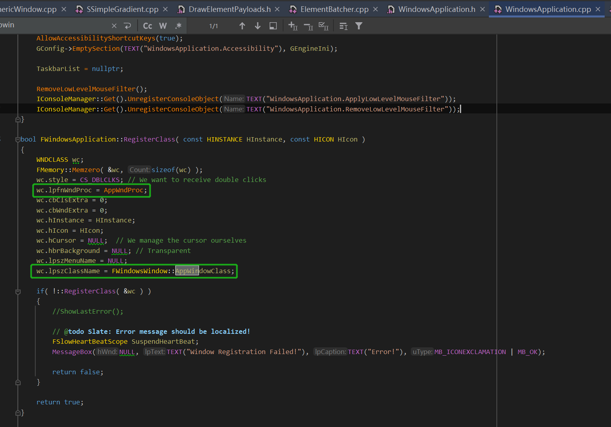
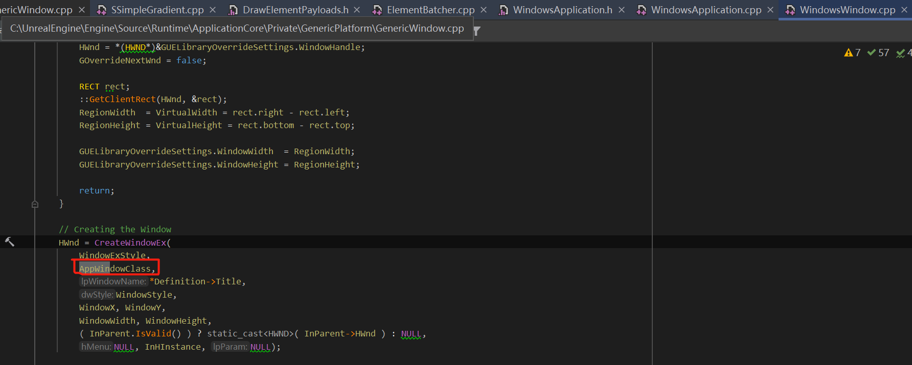
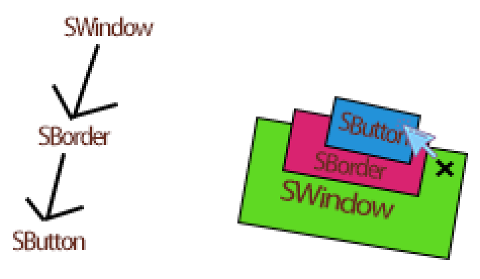
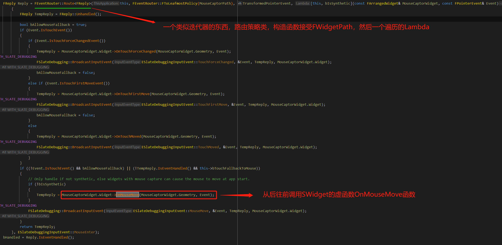

# 消息的路由



消息回调的注册在这里，AppWndProc，然后还有窗口类的名字，lpszClassName。

```c++
const TCHAR FWindowsWindow::AppWindowClass[] = TEXT("UnrealWindow");
```


之后创建窗口的时候，可以根据这个名字，去创建窗口，操作系统的消息就会转发到这个窗口。



创建窗口这里，传入了这个字符串，然后得到一个HWnd，Windows平台的窗口句柄。


我们看一下FWindowsApplication::AppWndProc，消息回调：

```c++
LRESULT CALLBACK FWindowsApplication::AppWndProc(HWND hwnd, uint32 msg, WPARAM wParam, LPARAM lParam)
{
	//当我们按下鼠标或者什么操作的时候，消息就会传播过来，hwnd是收到消息的窗口句柄
	return WindowsApplication_WndProc(hwnd, msg, wParam, lParam);
}
```


```c++
LRESULT WindowsApplication_WndProc(HWND hwnd, uint32 msg, WPARAM wParam, LPARAM lParam)
{
	return WindowsApplication_WndProc( hwnd, msg, wParam, lParam );
}
```


这个消息回调的调用，是我们在调用Win32的函数dispatch message的时候触发的：

```c++
void FWindowsApplication::PumpMessages( const float TimeDelta )
{
   MSG Message;

   // standard Windows message handling
   while(PeekMessage(&Message, NULL, 0, 0, PM_REMOVE))
   { 
      TranslateMessage(&Message);
      DispatchMessage(&Message); 
   }
}
```


然后我们看一下WindowsApplication_WndProc：

```c++
int32 FWindowsApplication::ProcessMessage(HWND hwnd, uint32 msg, WPARAM wParam, LPARAM lParam)
{
	//找到hwnd窗口句柄对应的FWindowsWindow，也就是我们定义的平台窗口类
	TSharedPtr<FWindowsWindow> CurrentNativeEventWindowPtr = FindWindowByHWND(Windows, hwnd);
    
    switch(msg)
    {
        case WM_MOUSEMOVE://鼠标移动的windows消息
            {
                BOOL Result = false;
                Result = MessageHandler->OnMouseMove();//调用FSlateApplication的OnMouseMove
                
                return Result ? 0 : 1;
            }
        //处理更多消息
    }
}
```

注意，我们创建FWindowsWindow的时候，也就是FGenericWindow的时候，会持有HWND，窗口句柄。


然后我们看看OnMouseMove函数：

```c++
bool FSlateApplication::OnMouseMove()
{
    bool Result = true;
	const FVector2D CurrentCursorPosition = GetCursorPos(); //通过win32的函数查询鼠标位置
	const FVector2D LastCursorPosition = GetLastCursorPos(); //我们获取上一帧鼠标的位置，这个我们每一帧都会存储
    
	//原地构造一个鼠标事件，平台无关的，我们自己定义的类
	FPointerEvent MouseEvent(
		GetUserIndexForMouse(), //FSlateUser，一个用户一个，暂时我们就当成一个，默认只有一个，只要有新的输入，就会注册
		CursorPointerIndex, //鼠标索引，这里是10，默认一个
		CurrentCursorPosition,//现在的鼠标位置
		LastCursorPosition,
		PressedMouseButton,//有没有按下什么鼠标的左右键
		EKeys::Invalid,
		0,//鼠标滚轮的偏移
		PlatformApplication->GetModifierKeys()//修饰键，比如ctrl，shift
	);
	
	//转发鼠标事件
	Result = ProcessMouseMoveEvent(MouseEvent);
}
```


```c++
bool FSlateApplication::ProcessMouseMoveEvent(const FPointerEvent& MouseEvent, bool bIsSynthetic)
{
    //这个函数是重点，会获取控件树点击到的一条路径，会判断一个鼠标的位置是否在一个网格内
	FWidgetPath WidgetsUnserCursor = bOverSlateWindow
	? LocateWindowUnderMouse(MouseEvent.GetScreenSpacePosition(), GetInteractiveTopLevelWindows(), false, MouseEvent.GetUserIndex())
		: FWidgetPath();
		
	//消息路由，开始派发到FWidgetPath
	bResult = RoutePointerMoveEvent(WidgetsUnderCursor, MouseEvent, bIsSynthetic);
	
	return bResult;
}
```


LocateWindowUnderMouse内部是很复杂的，后续介绍，FWidgetPath则是一个SWidget的数组，还携带一些额外的信息，这个数组是控件树上的一条路径，当我们鼠标点击到某个按钮的时候，会获取这个按钮到窗口的整个路径，然后消息从后往前遍历这个数组，一直派发下去。



当我们点击SButton的时候，会做2D网格碰撞检测，然后LocateWindowUnderMouse会遍历控件树，获取一条从SButton到SWindow根的路径(FWidgetPath)，然后我们的RoutePointerMoveEvent函数会将event转发到SButton的虚函数OnMouseMove身上。


RoutePointerMoveEvent里面的OnMouseMove，里面会构造一个FEeventRouter，路由策略类，相当于一个迭代器，构造函数接受FWidgetPath，然后从后往前，从SButton遍历到SWindow，一直传播FPointerEvent这个鼠标事件。



这个传播的过程，会调用SWidget的OnMouseMove这个虚函数，我们可以控制事件的传播过程，可以看到这里，首先定义了一个FReply类，一开始：

```c++
FReply TempReply = FReply::Unhandled();//未处理的事件
```


然后我们每次调用SWidget的OnMouseMove的时候，我们会判断这个事件是否还需要传播，通过TempReply.IsEventHandled()这个标记。


首先，它调用SButton的OnMouseMove：

```c++
FReply SButton::OnMouseMove( const FGeometry& MyGeometry, const FPointerEvent& MouseEvent )
{
	if ( IsPressed() && IsPreciseTapOrClick(MouseEvent) && FSlateApplication::Get().HasTraveledFarEnoughToTriggerDrag(MouseEvent, PressedScreenSpacePosition) )
	{
		Release();//切换按钮状态，松开状态，同时切换画刷样式
	}

	return FReply::Unhandled();//返回FReply
}
```


FReply::Unhandled说明还可以继续路由：

SBorder背景板的OnMouseMove没有重写，默认调用SWidget的OnMouseMove函数：

```c++
FReply SWidget::OnMouseMove(const FGeometry& MyGeometry, const FPointerEvent& MouseEvent)
{
	if (TSharedPtr<FSlateMouseEventsMetaData> Data = GetMetaData<FSlateMouseEventsMetaData>())//这个不用管，后续会讲解，大致就是鼠标移动的事件可以绑定委托，调用到这个虚函数的时候，会触发这个回调
	{
		if (Data->MouseMoveHandle.IsBound())
		{
			return Data->MouseMoveHandle.Execute(MyGeometry, MouseEvent);
		}
	}
	return FReply::Unhandled();//继续派发
}
```


调用SWindow的OnMouseMove函数：

```c++
FReply SWindow::OnMouseMove( const FGeometry& MyGeometry, const FPointerEvent& MouseEvent )
{
	if ( bDragAnywhere && this->HasMouseCapture() && MouseEvent.IsMouseButtonDown(EKeys::LeftMouseButton) && MoveResizeZone != EWindowZone::TitleBar )
	{
		this->MoveWindowTo( ScreenPosition + MouseEvent.GetCursorDelta() );
		return FReply::Handled();//当窗口设置为可以拖动的时候，会走这个路径，比如拖动标题栏区域
	}
	else
	{
		return FReply::Unhandled();//继续派发
	}

}
```


这个就是控件树的事件派发过程，slate的所有控件都这样操作，除了移动这个事件，还有按钮按下，按钮松开，输入一个字符的虚函数。


控件树的碰撞后续讲解。


