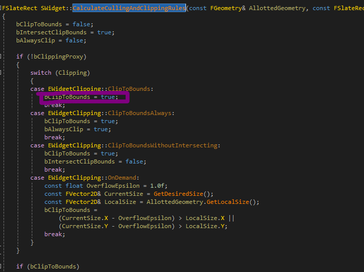
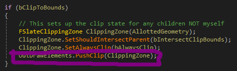
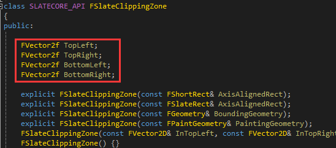
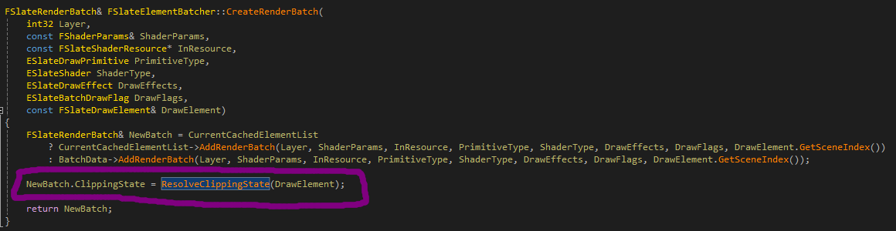
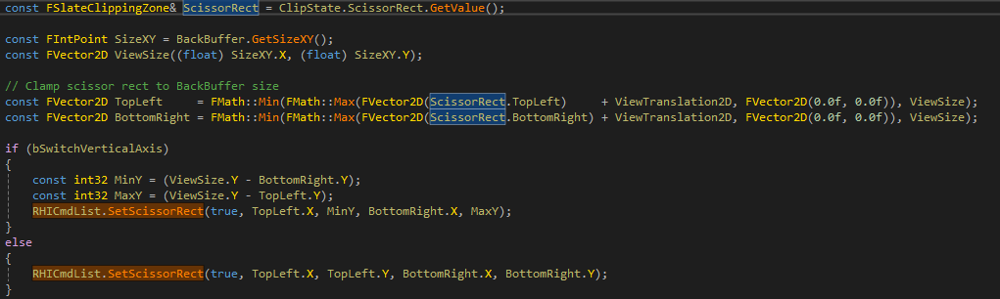

# 裁剪的原理

https://docs.unrealengine.com/4.27/zh-CN/ProgrammingAndScripting/Slate/ClippingSystem/，这是关于裁剪系统的介绍。

slate的裁剪是通过图形API设置scissor(裁剪矩形)或者模板测试(stencil test)来操控的，裁剪矩形会在GPU的像素着色器绘制之前，超出范围的区域给剔除掉。

经过我的测试，我写了一个小demo，用来测试vulkan的裁剪功能，通过设置scissor的大小，可以将外面的东西剔除掉，slate也是一个道理，我们来看一下怎么做的。

slate的裁剪通过控制EWidgetClipping这个枚举值来进行的，里面有个ClipToBounds的枚举值，这里只介绍这个，其余都差不多的功能，这个主要是绘制当前控件的时候，会将绘制出去的内容裁剪掉。

递归调用Paint/OnPaint生成控件图元的时候，会相应的根据当前控件裁剪枚举值，来判断是否设置控件的scissor或者stencil信息，

这个通过在Paint里面调用CalculateCullingAndClippingRules函数，这个函数输出bool变量，表示需要生成一个框的信息，来进行后续调用图形API的时候，来裁剪。

根据这个，会创建一个FSlateClippingZone，传入当前控件的大小几何信息AllottedGeometry。

然后压入到图元列表里面，为后续绘制的时候使用，OutDrawElements.PushClip(ClippingZone);

这个函数主要存放了一个SlateClippingZone的数组和一个uint32_t的数组，这个数组取名为stack，主要作用是索引SlateClippingZone数组的，OutDrawElements的这个SlateClippingZone只增不减，会在每一次遍历控件树的时候生成图元，而stack则会根据PopClip弹出，指向SlateClippingZone数组，至于为啥要这样做，是为了和之前的ClippingZone相交。

makebox等函数生成图元的时候，会获取当前stack的最后一个数字，然后再获取SlateClippingZone，生成RenderBatch图元，

然后绘制的时候，FSlateRHIRenderingPolicy::DrawElements里面，会根据RenderBatch的ClippingZone来设置裁剪矩形或者stencil。

