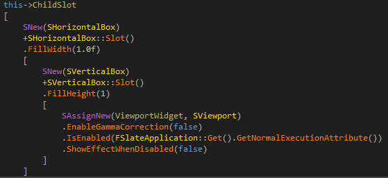
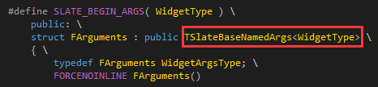
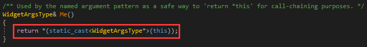
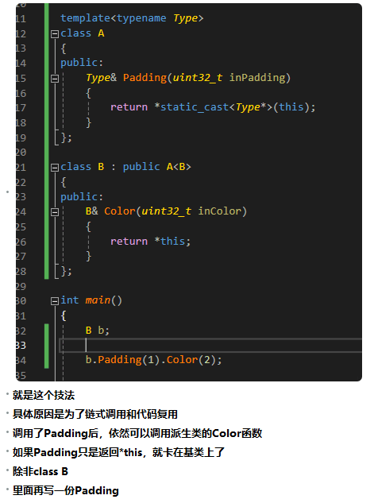

# 链式调用

这种称之为流式接口(fluent interface)，很古早的一种编程方式，可以在维基上搜到，具体来说，就是一个函数返回自身的引用，可以继续调用它的函数，但是有一个问题，就是为什么FArguments是模板类，用了奇异递归模板模式。

这里的作用是为了代码的复用，如果B派生自A，B拥有一个Color函数，A拥有一个Padding函数，B首先调用了A的Padding，然后继续调用Color的时候，就不行了，Padding返回的是A自己，否则，要拷贝一份Color到B里面，如果能返回B，就更好了，使用奇异递归模板模式就可以做到，将自身传入到基类的模板参数内，然后基类的函数返回这个模板参数类型的this。

