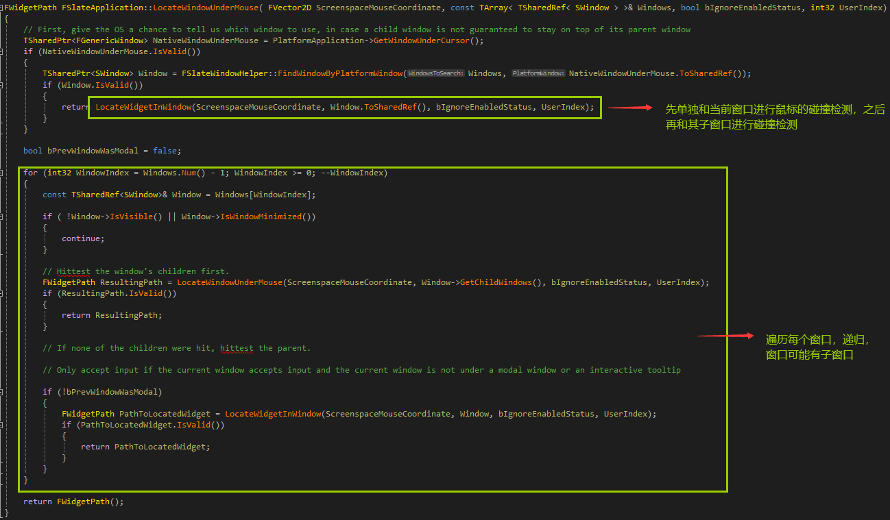

# 鼠标点击和碰撞网格

当鼠标点击的时候，会和视口中的控件进行2d的碰撞检测，判断一个点是否在一个矩形内。如果视口中有大量的控件，那么碰撞检测就会很耗时，需要遍历所有控件，但是我们点中的只是一个控件，如果有这样一个功能，先将视口内的控件进行粗略地划分，这个粗略的划分不是很耗时(相比于碰撞检测)，将其划分成一个一个小格子，每个格子是固定宽高，这个格子内有少量的控件，然后我们的鼠标位置先除以单个网格宽高，就能得到网格的具体位置，再和单个网格内的少量控件进行2d碰撞，就能节省大量时间，略过其它不需要碰撞检测的控件，slate就是使用这个方法。


# 具体原理

## 碰撞网格和点击事件的碰撞检测

当操作系统，比如windows，它的消息回调接受到WM_MOUSEMOVE的时候，会调用FSlateApplication的OnMouseMove函数，然后调用ProcessMouseMoveEvent(处理鼠标消息)进行鼠标消息的转发，转发到碰撞到的控件到根控件SWindow(这条链条)。


LocateWindowUnderMouse(定位鼠标下的控件)会返回碰撞到的控件到根控件SWindow的一条链，然后我们再调用RoutePointerMoveEvent遍历FWidgetPath这个数组(链)，然后调用每个控件的虚函数OnMouseMove，转发事件。


我们看一下LocateWindowUnderMouse是如何实现的



它是一个递归，每个窗口有自己的子窗口，首先和当前窗口进行碰撞检测LocateWidgetInWindow，再遍历循环当前窗口的子窗口进行递归，移动平台只有一个窗口，我们只需要关心LocateWidgetInWindow(定位窗口中的widget)这个函数就可以了。


首先，通过Window获取碰撞网格，碰撞网格是如何创建出来的，我们后续说，只是每个window都有一个它自己的FHittestGrid，然后调用FHittestGrid的GetBubblePath，进行2D碰撞检测，得到这个链。


这里进行了碰撞检测并且获取了这个碰撞到的widget到根SWindow的一条链条，也就是bubble path(冒泡路径)，

GetHitIndexFromCellIndex就是做了碰撞检测，这里有个关键的信息，GetCellCoordinate，传入鼠标位置，获取单个小网格的索引，也就是下图，整个视口被划分成了等宽等高的FCell(单个小网格)，我标注了每个控件是widgetN，比如绿色瓦片是widget6，这里假设我点击的位置是绿色圈圈(214,186)，先大致粗略地得到这个鼠标所在的单个小网格，就只需要和这个单个小网格的少量widget进行碰撞检测，比如这里的两个图片widget3和widget2，具体粗略地划分是通过GetCellCoordinate来进行的，直接通过除以128，128获取得到单个小网格的索引。


网格的索引如下，我们先进行大致粗略地划分，得到单个小网格FCell，通过214 / 128 向下取整得到x索引1，186 / 128向下取整得到y索引1，那么我们就获取得到了(1,1)编号的FCell，这个小网格会在消息处理前，创建好，里面存储了widget2和widget3的索引，然后我们只需要使用(214,186)遍历这两个控件进行碰撞检测就行了，就略过了其它不需要碰撞检测的控件。


FCell的结构如下，存储了一个widget的索引数组，FHittestGrid存放了一个SWidget指针的数组，FCell的索引就是这个指针数组的下标。


然后，我们接下来看一下鼠标位置是如何和widget2、widget3进行碰撞检测的，


首先，调用GetCollapseWidgets，获取(x,y)这个FCell下的swidget指针数组，里面会根据layer排序，保证layer大的widget在越后面，这样我们从后往前做碰撞检测，调用IsOverlppingSlateRotateRect，前面的WindowOrientedClipRect我们就当成swidget的FGeometry信息，不用管其它噪音。


具体调用如下，调用IsOverlappingSlateRotateRect，然后调用DistanceSqToSlateRotateRect，然后调用ClosestPointOnSlateRotatedRect，这个函数获取swidget的矩形的四条边，然后判断鼠标位置距离四条边的距离，如果在矩形内，那么距离就为0。


我们通过DistanceSqToSlateRotatedRect判断点到矩形的距离是否<=Radius * Radius，即<=0。


假设我们点击的是A位置，我们通过FMath::ClosestPointOnSegment2D获取B点，得到AB之间的距离是否<=0，来判断是否点击中。


当我们完成碰撞检测，我们回到这个函数，我们通过while，不断获取当前SWidget的父亲，然后放入数组中，就得到了一条widget在控件树上的链条，之后我们从前往后愉悦地遍历这个数组，派发鼠标事件了。


## 碰撞网格的创建

碰撞网格的创建，发生在递归调用控件树的Paint的时候，也就是生成图元Paint/OnPaint捎带着一起创建了碰撞网格，这样就会导致输入其实点击的是上一帧widget的碰撞网格，有点点延迟，但是感受不出来，好处是节省了递归次数。


碰撞网格会在每一次Paint开始前清理一下，在


PaintInvalidationRoot后续会调用SWindow的PaintSlowPath，然后调用Paint，递归生成图元，Paint会捎带着一起构建FCell，通过调用FHittestGrid的AddWidget。

```c++
Args.GetHittestGrid().AddWidget(MutableThis, 0, LayerId, FastPathProxyHandle.GetWidgetSortOrder());
```


我们来看看AddWidget怎么将当前SWidget添加进FCell的


调用GetCellCoordinate来获取SWidget的左上角所在的FCell索引，来获取SWidget的右下角所在的FCell索引，遍历FCell，将widget的索引添加到FCell里面，

因为一个SWidget可能会覆盖在多个FCell上面。


比如这个图片覆盖了(1,1)和(2,1)的FCell


## 宏观的代码上看碰撞的发生


宏观上是这样的，loop里面鼠标事件的处理发生在递归paint/onpaint前面，在FEngineLoop的Tick里面，是放在前面的，第一个tick会调用windows的DispatchMessage的win32函数，然后调用ProcessMouseMoveEvent。


还有一个就是，场景的绘制(GEngine->Tick)是发生在Tick(ESlateTickType::TimeAndWidgets)前面的，会调用我们耳熟能详，网上各种文章说的那个渲染器，然后渲染到一个纹理上，然后后续我们绘制控件的时候，将这个纹理贴膜一样贴到控件上，一般占据整个屏幕，这个控件叫做SViewpor(和SImage基本没什么区别，只不过用的图片是场景)。


